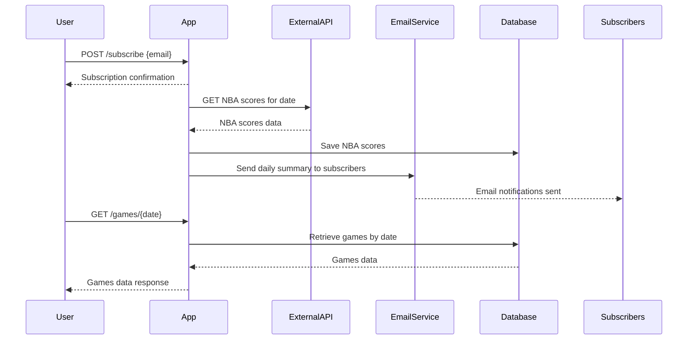
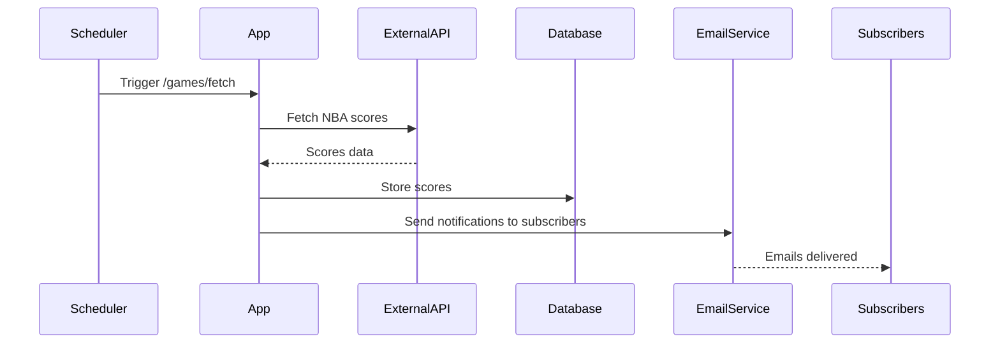

# Functional Requirements and API Design

## API Endpoints

### 1. Subscribe User  
**Endpoint:** `POST /subscribe`  
**Description:** Adds a user email to the subscription list.  
**Request:**  
```json
{
  "email": "user@example.com"
}
```  
**Response:**  
```json
{
  "message": "Subscription successful",
  "email": "user@example.com"
}
```

### 2. Retrieve Subscribers  
**Endpoint:** `GET /subscribers`  
**Description:** Retrieves the list of all subscribed email addresses.  
**Response:**  
```json
{
  "subscribers": [
    "user1@example.com",
    "user2@example.com"
  ]
}
```

### 3. Fetch and Store NBA Scores  
**Endpoint:** `POST /games/fetch`  
**Description:** Triggers fetching NBA game scores from the external API for today’s date, stores them locally, and triggers notification sending.  
**Request:**  
```json
{
  "date": "YYYY-MM-DD" // optional, defaults to current date if not provided
}
```  
**Response:**  
```json
{
  "message": "Scores fetched, stored and notifications sent",
  "date": "YYYY-MM-DD",
  "gamesCount": 15
}
```

### 4. Retrieve All Games  
**Endpoint:** `GET /games/all`  
**Description:** Retrieves all stored NBA game data, supports optional pagination.  
**Query Parameters:**  
- `page` (optional, default 0)  
- `size` (optional, default 20)  
**Response:**  
```json
{
  "page": 0,
  "size": 20,
  "totalGames": 100,
  "games": [
    {
      "date": "2025-03-25",
      "homeTeam": "Lakers",
      "awayTeam": "Warriors",
      "homeScore": 110,
      "awayScore": 105,
      "status": "Final"
    },
    ...
  ]
}
```

### 5. Retrieve Games by Date  
**Endpoint:** `GET /games/{date}`  
**Description:** Retrieves all NBA games stored for a specific date.  
**Response:**  
```json
{
  "date": "2025-03-25",
  "games": [
    {
      "homeTeam": "Lakers",
      "awayTeam": "Warriors",
      "homeScore": 110,
      "awayScore": 105,
      "status": "Final"
    },
    ...
  ]
}
```

---

## Business Logic Notes

- The external API call (to fetch scores) and notification sending are triggered only via the `POST /games/fetch` endpoint or the scheduled background job.
- GET endpoints are only for retrieving stored data.
- Subscription management is limited to adding subscribers via POST, no unsubscribe or update endpoint at this stage.
- Emails contain simple text summaries of the day’s NBA game scores.
- Historical game data is retained indefinitely.

---

## User-App Interaction Sequence Diagram



---

## Daily Scheduler Flow

