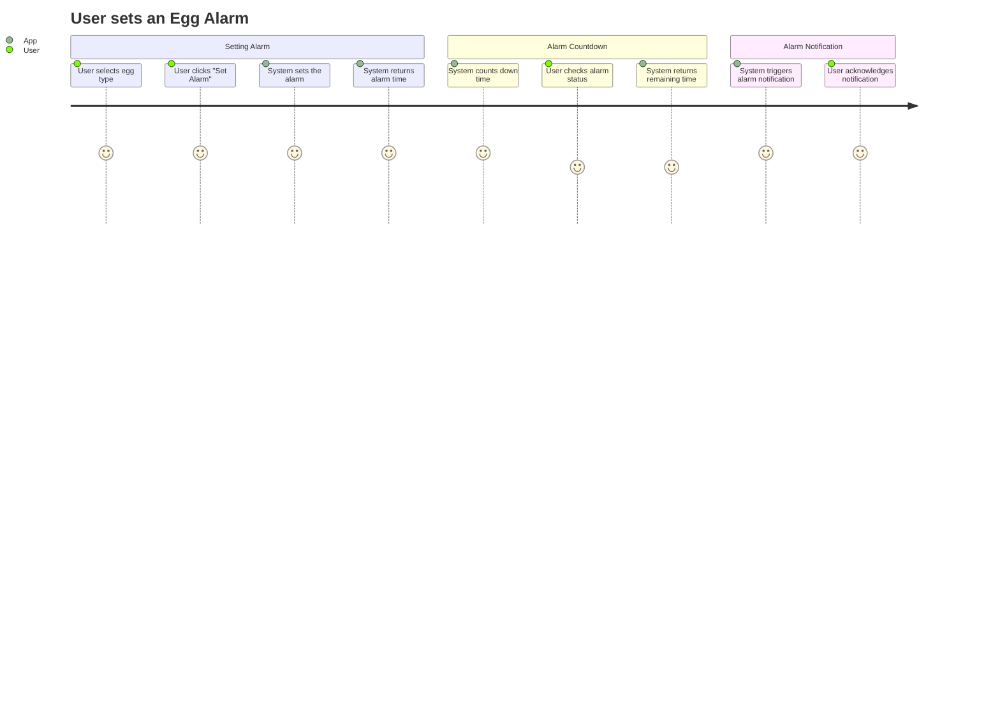
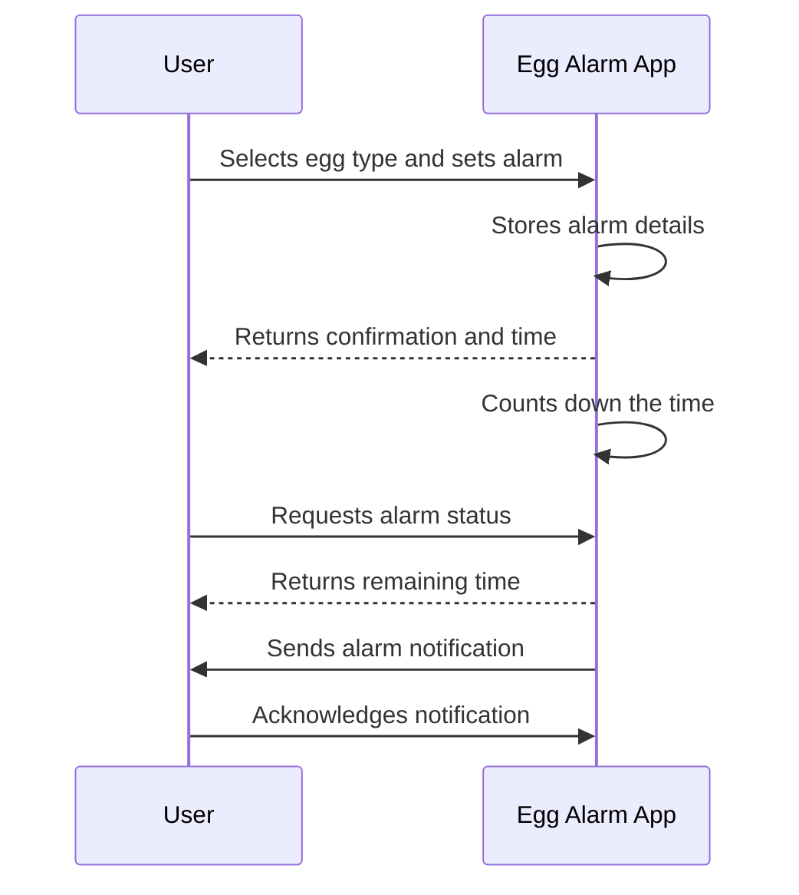

# Egg Alarm App - Final Functional Requirements

## API Endpoints

### 1. Create Alarm
- **Endpoint**: `/api/alarm`
- **Method**: `POST`
- **Description**: Sets an alarm for the selected type of egg.
- **Request Format**:
  ```json
  {
    "eggType": "soft-boiled" // options: soft-boiled, medium-boiled, hard-boiled
  }
  ```
- **Response Format**:
  ```json
  {
    "message": "Alarm set for soft-boiled eggs",
    "time": 300 // time in seconds
  }
  ```

### 2. Get Alarm Status
- **Endpoint**: `/api/alarm/status`
- **Method**: `GET`
- **Description**: Retrieves the current status of the alarm.
- **Response Format**:
  ```json
  {
    "status": "active", // options: active, completed
    "remainingTime": 120 // time in seconds
  }
  ```

### 3. Cancel Alarm
- **Endpoint**: `/api/alarm/cancel`
- **Method**: `POST`
- **Description**: Cancels the active egg alarm.
- **Response Format**:
  ```json
  {
    "message": "Alarm cancelled"
  }
  ```

## User-App Interaction



