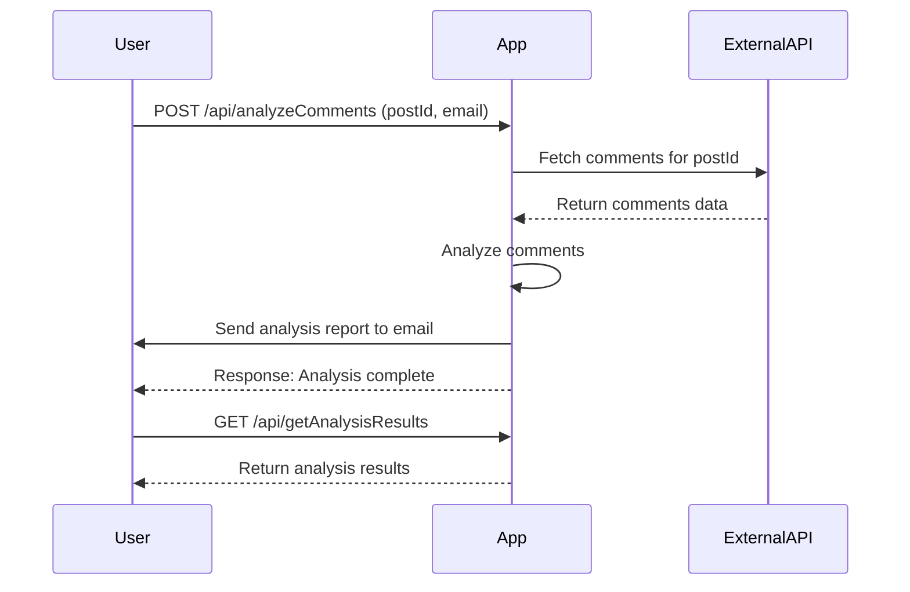

Certainly! Here is the final version of the functional requirements for your project:

# Functional Requirements for Comment Analysis Application

## API Endpoints

### 1. Fetch and Analyze Comments
- **Endpoint**: `/api/analyzeComments`
- **Method**: `POST`
- **Request**:
  - **Content-Type**: `application/json`
  - **Body**:
    ```json
    {
      "postId": <integer>,
      "email": "<recipient-email@example.com>"
    }
    ```
- **Response**:
  - **Content-Type**: `application/json`
  - **Body**:
    ```json
    {
      "status": "success",
      "message": "Analysis complete and report sent to email."
    }
    ```

### 2. Retrieve Analysis Results
- **Endpoint**: `/api/getAnalysisResults`
- **Method**: `GET`
- **Response**:
  - **Content-Type**: `application/json`
  - **Body**:
    ```json
    {
      "results": [
        {
          "postId": <integer>,
          "analysis": {
            "sentimentScore": <decimal>,
            "keyPhrases": ["<phrase1>", "<phrase2>"]
          },
          "emailSent": true
        }
      ]
    }
    ```

## User-App Interaction



Feel free to use this as a guide for your application's implementation. If you need any further assistance, don't hesitate to ask!