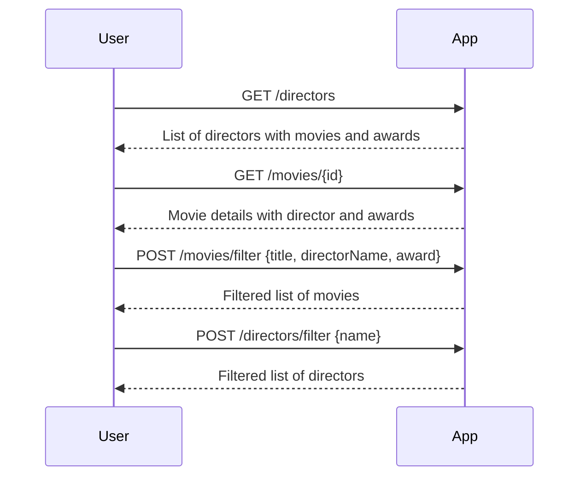
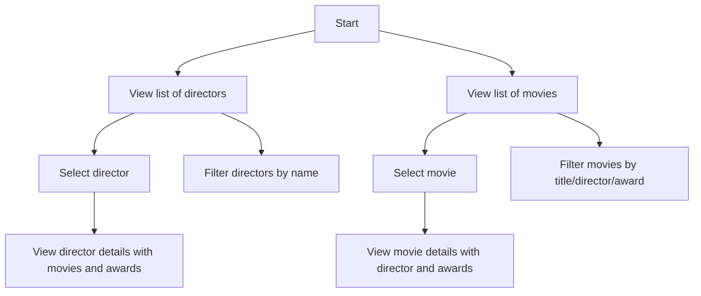

```markdown
# Functional Requirements for Movies-Directors-Oscar Awards Application

## API Endpoints

### 1. Director Endpoints

#### GET /directors
- Description: Retrieve a list of all directors with their movies and each movie’s awards.
- Response:
```json
[
  {
    "id": "uuid",
    "name": "string",
    "movies": [
      {
        "id": "uuid",
        "title": "string",
        "awards": ["string", "..."]
      }
    ]
  }
]
```

#### GET /directors/{id}
- Description: Retrieve a single director by ID, including their movies and awards.
- Response: Same structure as above but for a single director object.

#### POST /directors/filter
- Description: Filter directors by fields such as name.
- Request:
```json
{
  "name": "optional string"
}
```
- Response: Same as GET /directors but filtered accordingly.

---

### 2. Movie Endpoints

#### GET /movies
- Description: Retrieve all movies with their director info and awards.
- Response:
```json
[
  {
    "id": "uuid",
    "title": "string",
    "director": {
      "id": "uuid",
      "name": "string"
    },
    "awards": ["string", "..."]
  }
]
```

#### GET /movies/{id}
- Description: Retrieve a movie by ID with director and awards.
- Response: Same as above but for a single movie.

#### POST /movies/filter
- Description: Filter movies by fields like title, director name, or award name.
- Request:
```json
{
  "title": "optional string",
  "directorName": "optional string",
  "award": "optional string"
}
```
- Response: Same as GET /movies but filtered accordingly.

---

## Business Logic

- All external data retrieval or complex calculations (if added later) will be implemented in POST endpoints.
- GET endpoints are only for retrieving stored application data without side effects.

---

## User-App Interaction Sequence Diagram



---

## User Journey Diagram


```