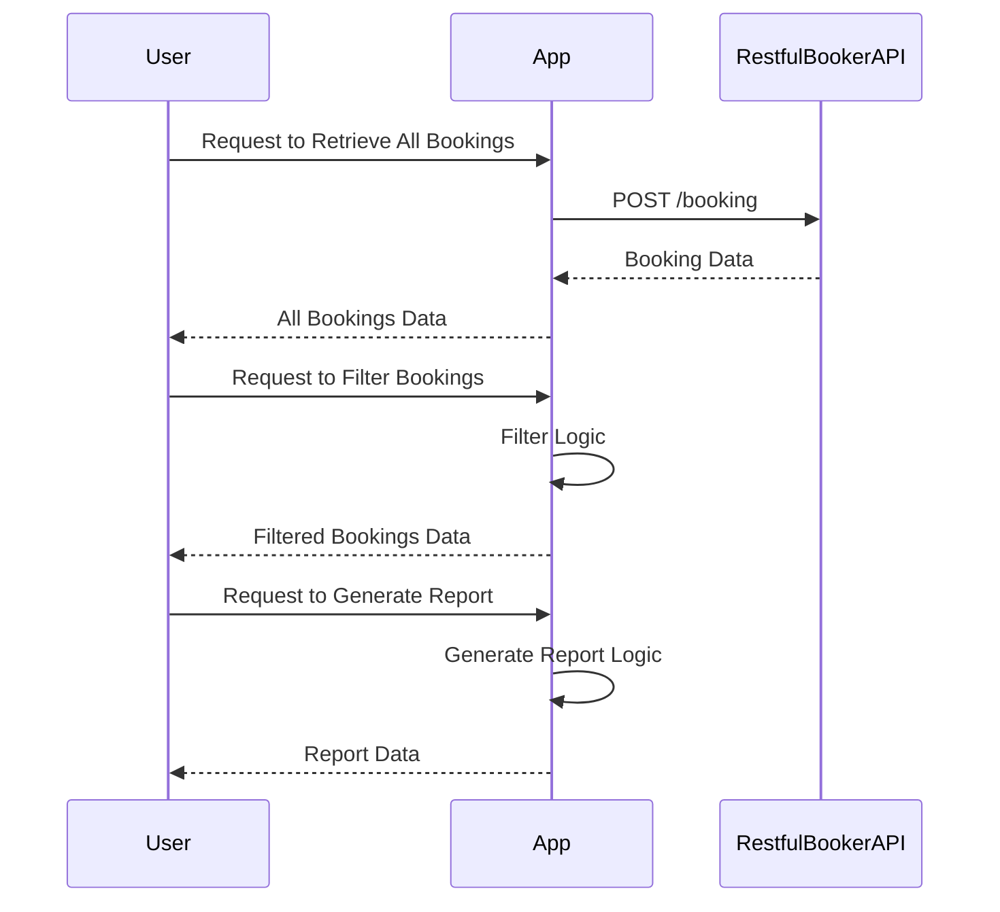

Certainly! Here's the finalized version of the functional requirements for your project:

# Functional Requirements for Booking Reports Application

## API Endpoints

### 1. Retrieve All Bookings
- **Endpoint**: `/api/bookings`
- **Method**: `POST`
- **Description**: Fetches all booking data from the Restful Booker API.
- **Request Body**: None
- **Response**: 
  ```json
  {
    "bookings": [
      {
        "id": 1,
        "firstName": "John",
        "lastName": "Doe",
        "totalPrice": 150,
        "depositPaid": true,
        "bookingDates": {
          "checkIn": "2023-01-01",
          "checkOut": "2023-01-10"
        }
      }
    ]
  }
  ```

### 2. Filter Bookings
- **Endpoint**: `/api/bookings/filter`
- **Method**: `POST`
- **Description**: Filters bookings based on specified criteria.
- **Request Body**:
  ```json
  {
    "filterCriteria": {
      "bookingDates": {
        "start": "2023-01-01",
        "end": "2023-12-31"
      },
      "totalPrice": {
        "min": 100,
        "max": 500
      },
      "depositPaid": true
    }
  }
  ```
- **Response**:
  ```json
  {
    "filteredBookings": [
      {
        "id": 2,
        "firstName": "Jane",
        "lastName": "Smith",
        "totalPrice": 200,
        "depositPaid": true,
        "bookingDates": {
          "checkIn": "2023-05-01",
          "checkOut": "2023-05-05"
        }
      }
    ]
  }
  ```

### 3. Generate Reports
- **Endpoint**: `/api/reports`
- **Method**: `POST`
- **Description**: Generates a report summarizing the booking data.
- **Request Body**: 
  ```json
  {
    "reportCriteria": {
      "dateRange": {
        "start": "2023-01-01",
        "end": "2023-12-31"
      }
    }
  }
  ```
- **Response**:
  ```json
  {
    "report": {
      "totalRevenue": 5000,
      "averageBookingPrice": 250,
      "numberOfBookings": 20
    }
  }
  ```

## User-App Interaction



Let me know if there's anything else you'd like to adjust or add!