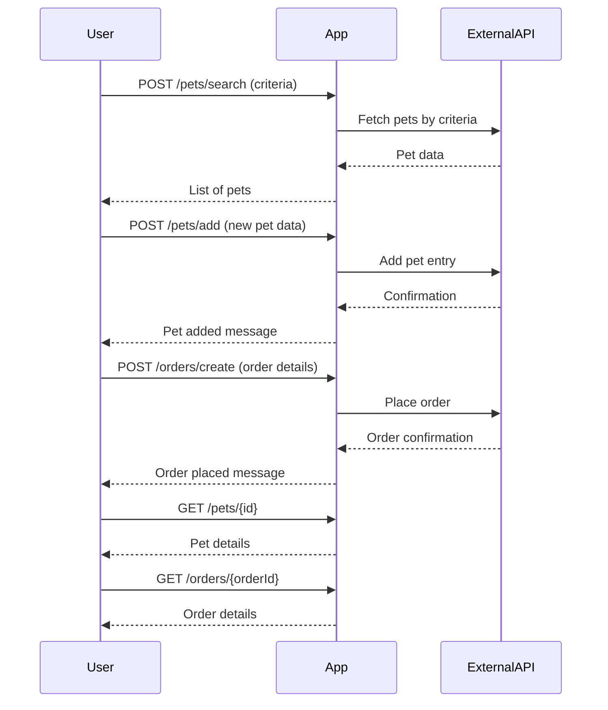

```markdown
# Functional Requirements for 'Purrfect Pets' API

## API Endpoints

### 1. POST /pets/search  
Search pets by criteria and retrieve data from external Petstore API.

**Request:**
```json
{
  "status": "available",      // optional: available, pending, sold
  "type": "dog",              // optional: dog, cat, etc.
  "name": "Buddy"             // optional: partial or full name
}
```

**Response:**
```json
{
  "pets": [
    {
      "id": 123,
      "name": "Buddy",
      "type": "dog",
      "status": "available",
      "photoUrls": ["url1", "url2"]
    }
  ]
}
```

---

### 2. POST /pets/add  
Add a new pet entry (business logic to sync with external API or internal store).

**Request:**
```json
{
  "name": "Whiskers",
  "type": "cat",
  "status": "available",
  "photoUrls": ["url1"]
}
```

**Response:**
```json
{
  "id": 456,
  "message": "Pet added successfully"
}
```

---

### 3. POST /orders/create  
Place an order for a pet.

**Request:**
```json
{
  "petId": 123,
  "quantity": 1,
  "shipDate": "2024-06-15T12:00:00Z",
  "status": "placed"
}
```

**Response:**
```json
{
  "orderId": 789,
  "message": "Order placed successfully"
}
```

---

### 4. GET /pets/{id}  
Retrieve pet details stored or cached by the application.

**Response:**
```json
{
  "id": 123,
  "name": "Buddy",
  "type": "dog",
  "status": "available",
  "photoUrls": ["url1", "url2"]
}
```

---

### 5. GET /orders/{orderId}  
Retrieve order details.

**Response:**
```json
{
  "orderId": 789,
  "petId": 123,
  "quantity": 1,
  "shipDate": "2024-06-15T12:00:00Z",
  "status": "placed"
}
```

---

## Mermaid Sequence Diagram: User-App Interaction


```