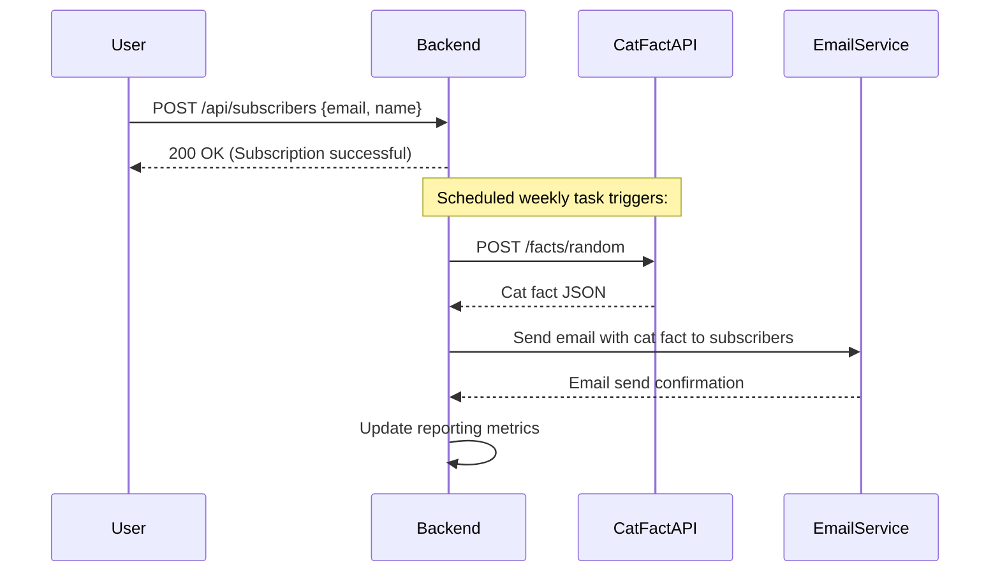
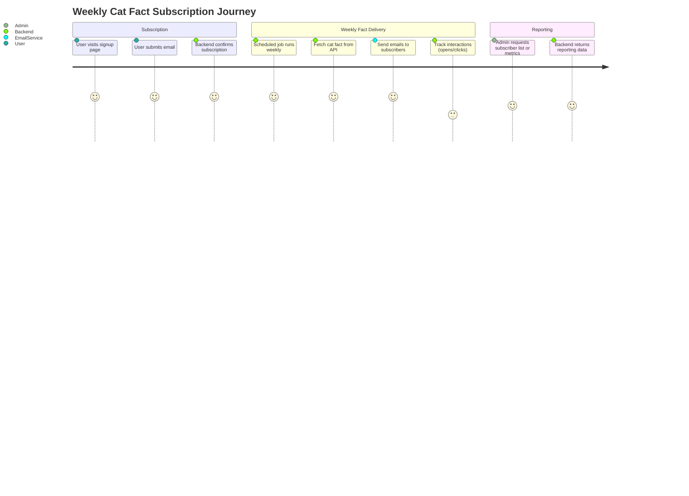

```markdown
# Functional Requirements and API Specification for Weekly Cat Fact Subscription

## API Endpoints

### 1. User Subscription

- **Endpoint:** `POST /api/subscribers`
- **Description:** User signs up for weekly cat fact emails.
- **Request:**
  ```json
  {
    "email": "user@example.com",
    "name": "Optional User Name"
  }
  ```
- **Response:**
  ```json
  {
    "subscriberId": "uuid",
    "message": "Subscription successful"
  }
  ```

### 2. Retrieve Subscriber List (Reporting)

- **Endpoint:** `GET /api/subscribers`
- **Description:** Retrieve list of all subscribers (for admin/reporting).
- **Response:**
  ```json
  [
    {
      "subscriberId": "uuid",
      "email": "user@example.com",
      "name": "User Name",
      "subscribedAt": "2024-05-01T12:00:00Z"
    }
  ]
  ```

### 3. Trigger Weekly Cat Fact Retrieval and Email Send-Out

- **Endpoint:** `POST /api/facts/send-weekly`
- **Description:** Internal endpoint to fetch a new cat fact from external API and send it to all subscribers.
- **Request:** No body required.
- **Response:**
  ```json
  {
    "factId": "uuid",
    "factText": "Cats have five toes on their front paws.",
    "sentToSubscribers": 100
  }
  ```

### 4. Retrieve Reporting Metrics

- **Endpoint:** `GET /api/reporting/metrics`
- **Description:** Retrieve reporting data such as subscriber count and interaction stats.
- **Response:**
  ```json
  {
    "totalSubscribers": 100,
    "emailsSent": 52,
    "averageOpenRate": 0.42,
    "averageClickRate": 0.15
  }
  ```

---

## Mermaid Sequence Diagram: User Subscription and Weekly Email Flow



---

## Mermaid Journey Diagram: Weekly Cat Fact Subscription User Journey


```