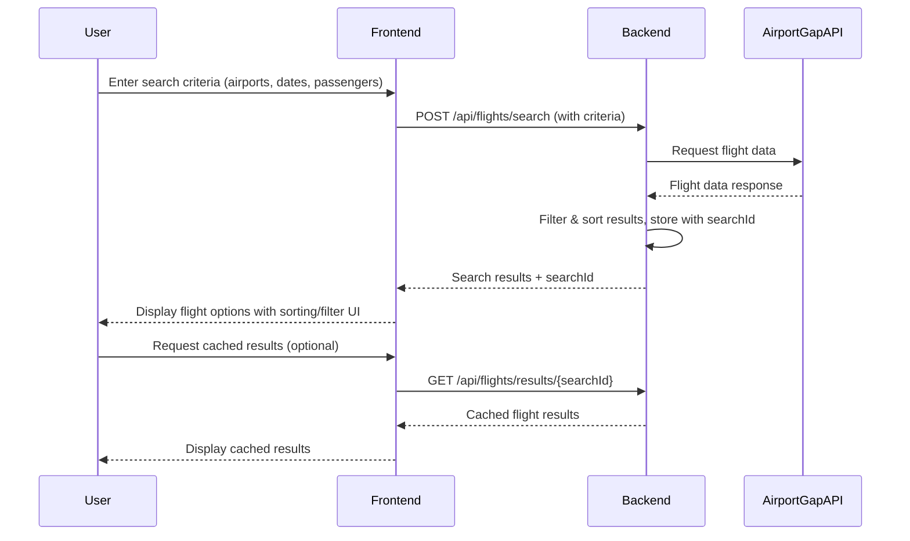
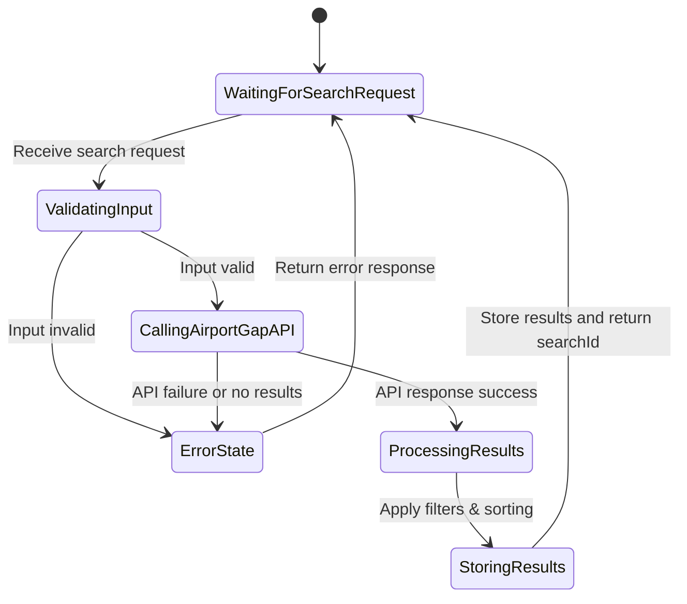

```markdown
# Flight Search Application - Functional Requirements

## API Endpoints

### 1. Search Flights (POST `/api/flights/search`)

- **Purpose:** Query the Airport Gap API with user input and return filtered flight search results.
- **Request Body:**  
```json
{
  "departureAirport": "string",       // IATA code, e.g. "JFK"
  "arrivalAirport": "string",         // IATA code, e.g. "LAX"
  "departureDate": "yyyy-MM-dd",      // Date of travel
  "returnDate": null,                 // null for one-way trips
  "passengers": integer,              // Number of passengers
  "filters": {                        // Optional filters for results
    "airlines": ["string"],           // Filter by airline codes
    "maxPrice": number,               // Maximum price filter
    "departureTimeRange": {           // Time range filter for departure
      "from": "HH:mm",
      "to": "HH:mm"
    }
  },
  "sortBy": "price|departureTime|arrivalTime",  // Sort field
  "sortOrder": "asc|desc"             // Sort order
}
```
- **Response:**  
```json
{
  "flights": [
    {
      "flightId": "string",
      "airline": "string",
      "flightNumber": "string",
      "departureAirport": "string",
      "arrivalAirport": "string",
      "departureTime": "ISO8601 datetime",
      "arrivalTime": "ISO8601 datetime",
      "price": number,
      "currency": "string"
    }
  ],
  "totalResults": integer
}
```
- **Errors:**  
  - 400 Bad Request for missing/invalid params  
  - 502 Bad Gateway for API failures  
  - 404 Not Found if no flights found

---

### 2. Retrieve Cached/Search History Results (GET `/api/flights/results/{searchId}`)

- **Purpose:** Retrieve previously searched flight results by searchId.
- **Response:** Same as the search response above.
- **Errors:**  
  - 404 Not Found if searchId does not exist

---

## Business Logic Notes

- The POST `/api/flights/search` endpoint triggers the workflow:
  - Validate input
  - Call Airport Gap API
  - Process results, apply filters and sorting
  - Store results with a unique `searchId`
  - Return the results and `searchId` for future retrieval

- GET endpoint only returns stored results by `searchId`.

---

## User-App Interaction Sequence Diagram



---

## Flight Search Flow (Entity Workflow)


```