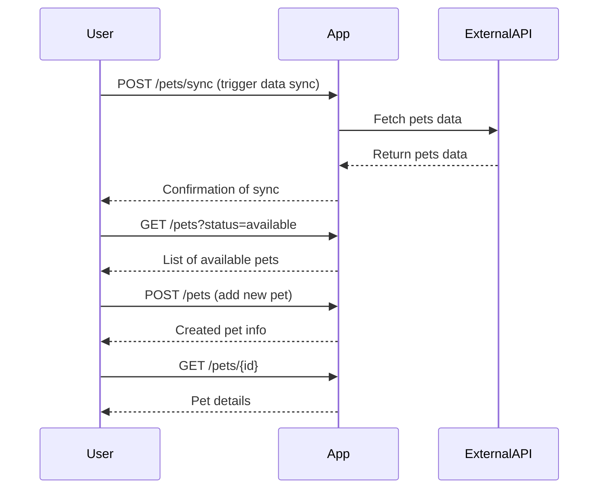
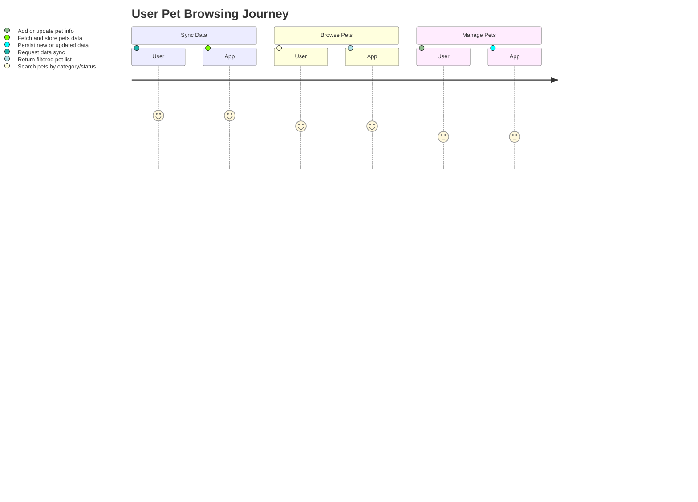

```markdown
# Functional Requirements for "Purrfect Pets" API

## API Endpoints

### 1. Add or Refresh Pets Data (POST /pets/sync)
- **Purpose:** Synchronize or refresh pets data by retrieving from external Petstore API.
- **Request:**
  ```json
  {
    "sourceUrl": "string"  // URL of external Petstore API or empty for default
  }
  ```
- **Response:**
  ```json
  {
    "status": "success",
    "message": "Pets data synchronized",
    "count": 100  // number of pets imported/updated
  }
  ```

### 2. Create New Pet (POST /pets)
- **Purpose:** Add a new pet manually.
- **Request:**
  ```json
  {
    "name": "string",
    "category": "string",
    "status": "available|pending|sold",
    "tags": ["string"],
    "photoUrls": ["string"]
  }
  ```
- **Response:**
  ```json
  {
    "id": "long",
    "name": "string",
    "category": "string",
    "status": "string",
    "tags": ["string"],
    "photoUrls": ["string"]
  }
  ```

### 3. Update Pet Info (POST /pets/{petId})
- **Purpose:** Update pet information.
- **Request:**
  ```json
  {
    "name": "string",
    "category": "string",
    "status": "available|pending|sold",
    "tags": ["string"],
    "photoUrls": ["string"]
  }
  ```
- **Response:**
  ```json
  {
    "id": "long",
    "name": "string",
    "category": "string",
    "status": "string",
    "tags": ["string"],
    "photoUrls": ["string"]
  }
  ```

### 4. Get Pet by ID (GET /pets/{petId})
- **Purpose:** Retrieve pet details by pet ID.
- **Response:**
  ```json
  {
    "id": "long",
    "name": "string",
    "category": "string",
    "status": "available|pending|sold",
    "tags": ["string"],
    "photoUrls": ["string"]
  }
  ```

### 5. Search Pets (GET /pets)
- **Purpose:** List or search pets by optional filters.
- **Query Parameters:** 
  - `status` (optional): filter by pet status
  - `category` (optional): filter by category
- **Response:**
  ```json
  [
    {
      "id": "long",
      "name": "string",
      "category": "string",
      "status": "string",
      "tags": ["string"],
      "photoUrls": ["string"]
    }
  ]
  ```

---

## User-App Interaction Sequence Diagram



---

## Example Journey Diagram


```