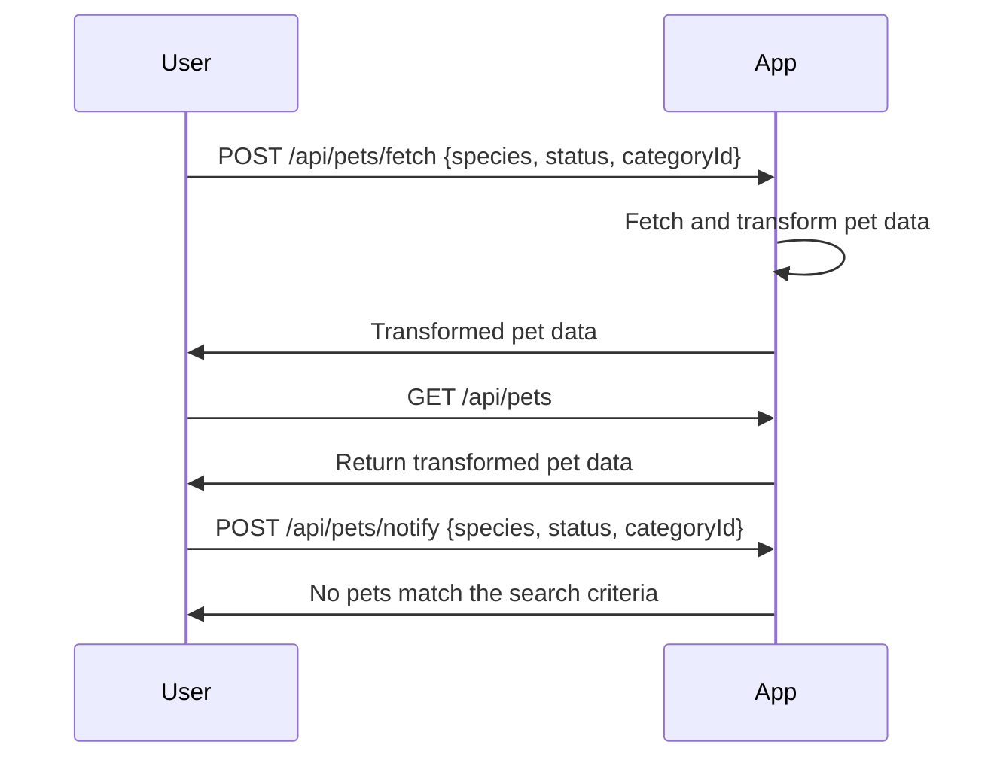

# Final Functional Requirements for Filtered Pet Search Application

## API Endpoints

### 1. Fetch and Transform Pet Details
- **Endpoint**: `/api/pets/fetch`
- **Method**: POST
- **Description**: Fetches pet details from an external source and transforms the data into a user-friendly format.
- **Request Format**:
  ```json
  {
    "species": "string",       // e.g., "dog"
    "status": "string",        // e.g., "available"
    "categoryId": "integer"    // e.g., 1
  }
  ```
- **Response Format**:
  ```json
  {
    "pets": [
      {
        "Name": "string",              // Transformed field from "petName"
        "Species": "string",
        "Status": "string",
        "CategoryId": "integer",
        "AvailabilityStatus": "string" // New attribute
      }
    ]
  }
  ```

### 2. Retrieve Transformed Pet Data
- **Endpoint**: `/api/pets`
- **Method**: GET
- **Description**: Retrieves the list of pets that match the search criteria with their transformed information.
- **Response Format**:
  ```json
  {
    "pets": [
      {
        "Name": "string",
        "Species": "string",
        "Status": "string",
        "CategoryId": "integer",
        "AvailabilityStatus": "string"
      }
    ]
  }
  ```

### 3. Notification for No Matching Pets
- **Endpoint**: `/api/pets/notify`
- **Method**: POST
- **Description**: Notifies the user if no pets match the search criteria.
- **Request Format**:
  ```json
  {
    "species": "string",
    "status": "string",
    "categoryId": "integer"
  }
  ```
- **Response Format**:
  ```json
  {
    "message": "No pets match the search criteria."
  }
  ```

## User-App Interaction Diagram



This document outlines the necessary API endpoints and provides a visual representation of the interaction between the user and the application using Mermaid diagrams.