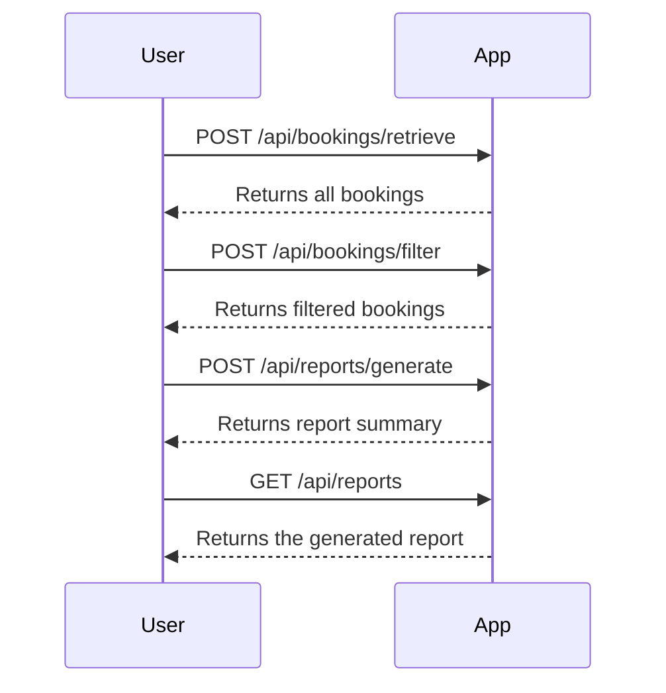

# Final Functional Requirements

## API Endpoints

### 1. Retrieve All Bookings
- **Endpoint**: `POST /api/bookings/retrieve`
- **Description**: Fetches all bookings from the Restful Booker API.
- **Request Format**: 
  ```json
  {
    "apiKey": "your_api_key_here"
  }
  ```
- **Response Format**: 
  ```json
  {
    "bookings": [
      {
        "id": 1,
        "firstName": "John",
        "lastName": "Doe",
        "totalPrice": 150,
        "depositPaid": true,
        "bookingDates": {
          "checkIn": "2023-01-01",
          "checkOut": "2023-01-10"
        }
      }
    ]
  }
  ```

### 2. Filter Bookings
- **Endpoint**: `POST /api/bookings/filter`
- **Description**: Filters bookings based on criteria like booking dates, total price, or deposit paid status.
- **Request Format**: 
  ```json
  {
    "filterCriteria": {
      "startDate": "2023-01-01",
      "endDate": "2023-12-31",
      "minPrice": 100,
      "maxPrice": 500,
      "depositPaid": true
    }
  }
  ```
- **Response Format**: 
  ```json
  {
    "filteredBookings": [
      {
        "id": 2,
        "firstName": "Jane",
        "lastName": "Smith",
        "totalPrice": 200,
        "depositPaid": true,
        "bookingDates": {
          "checkIn": "2023-05-01",
          "checkOut": "2023-05-05"
        }
      }
    ]
  }
  ```

### 3. Generate Reports
- **Endpoint**: `POST /api/reports/generate`
- **Description**: Generates reports summarizing booking data.
- **Request Format**: 
  ```json
  {
    "reportCriteria": {
      "startDate": "2023-01-01",
      "endDate": "2023-12-31"
    }
  }
  ```
- **Response Format**: 
  ```json
  {
    "totalRevenue": 1500,
    "averageBookingPrice": 200,
    "numberOfBookings": 10
  }
  ```

### 4. Retrieve Report
- **Endpoint**: `GET /api/reports`
- **Description**: Retrieves the generated report.
- **Response Format**: 
  ```json
  {
    "report": {
      "totalRevenue": 1500,
      "averageBookingPrice": 200,
      "numberOfBookings": 10
    }
  }
  ```

## User-App Interaction

