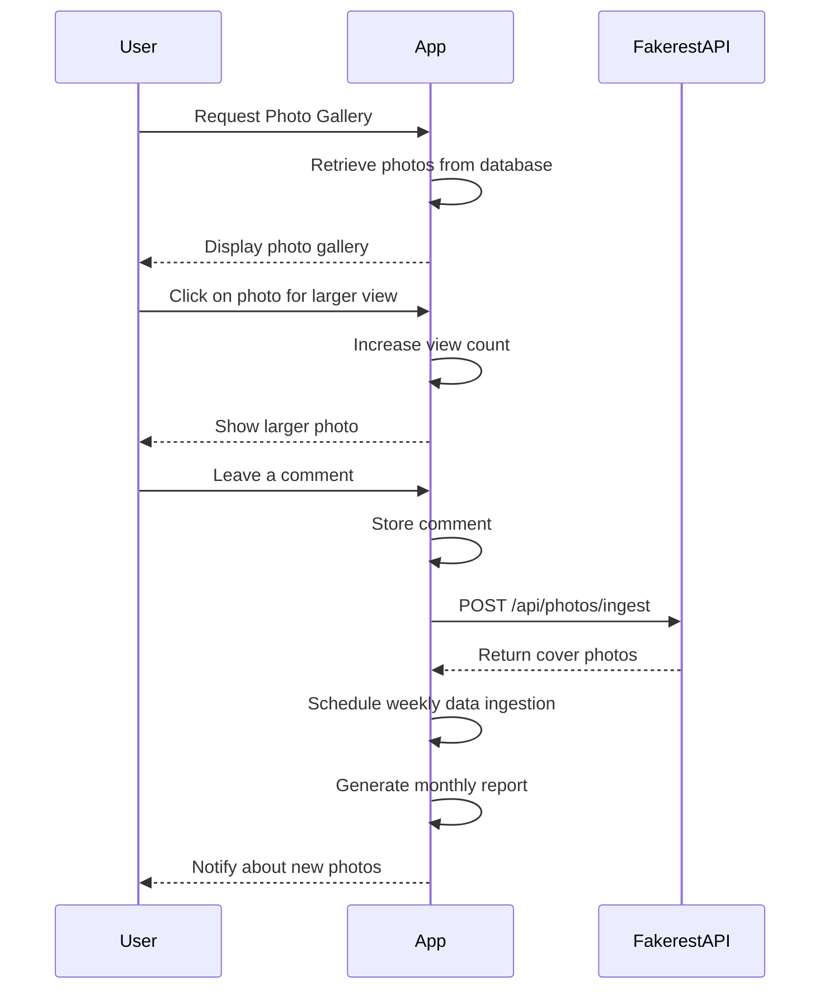

## Final Functional Requirements

### API Endpoints

#### 1. Data Ingestion Endpoint
- **Endpoint:** `POST /api/photos/ingest`
- **Description:** Fetches cover photo data from the Fakerest API and stores it in the application database.
- **Request:** 
  ```json
  {
    "source": "Fakerest API"
  }
  ```
- **Response:**
  ```json
  {
    "status": "success",
    "message": "Data ingestion completed"
  }
  ```

#### 2. Display Gallery Endpoint
- **Endpoint:** `GET /api/photos/gallery`
- **Description:** Retrieves cover photo data to be displayed in the gallery format.
- **Response:**
  ```json
  [
    {
      "id": 1,
      "title": "Book Cover",
      "url": "https://example.com/photo1.jpg",
      "views": 150
    },
    {
      "id": 2,
      "title": "Another Cover",
      "url": "https://example.com/photo2.jpg",
      "views": 200
    }
  ]
  ```

#### 3. View and Comment Endpoint
- **Endpoint:** `POST /api/photos/{photoId}/view`
- **Description:** Increases the view count of a photo and allows users to leave comments.
- **Request:**
  ```json
  {
    "comment": "Great cover photo!"
  }
  ```
- **Response:**
  ```json
  {
    "status": "success",
    "message": "View and comment recorded"
  }
  ```

#### 4. Report Generation Endpoint
- **Endpoint:** `POST /api/photos/reports/monthly`
- **Description:** Generates a report of the most viewed cover photos for the month.
- **Response:**
  ```json
  {
    "status": "success",
    "reportUrl": "https://example.com/reports/monthly.pdf"
  }
  ```

#### 5. Notification Endpoint
- **Endpoint:** `POST /api/photos/notify`
- **Description:** Notifies users about new cover photos added to the gallery.
- **Request:**
  ```json
  {
    "notificationType": "email"
  }
  ```
- **Response:**
  ```json
  {
    "status": "success",
    "message": "Notifications sent"
  }
  ```

### User-App Interaction Diagram



This finalized version outlines the confirmed functional requirements and provides a visual representation of user interactions with the application. If you have any further adjustments or confirmations, feel free to let me know!