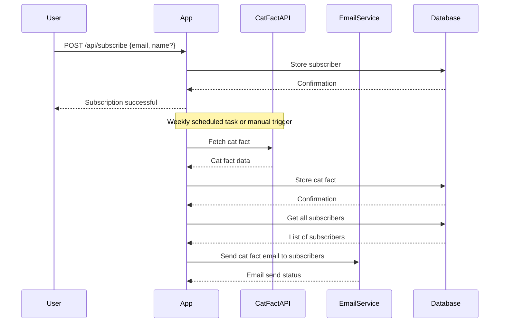
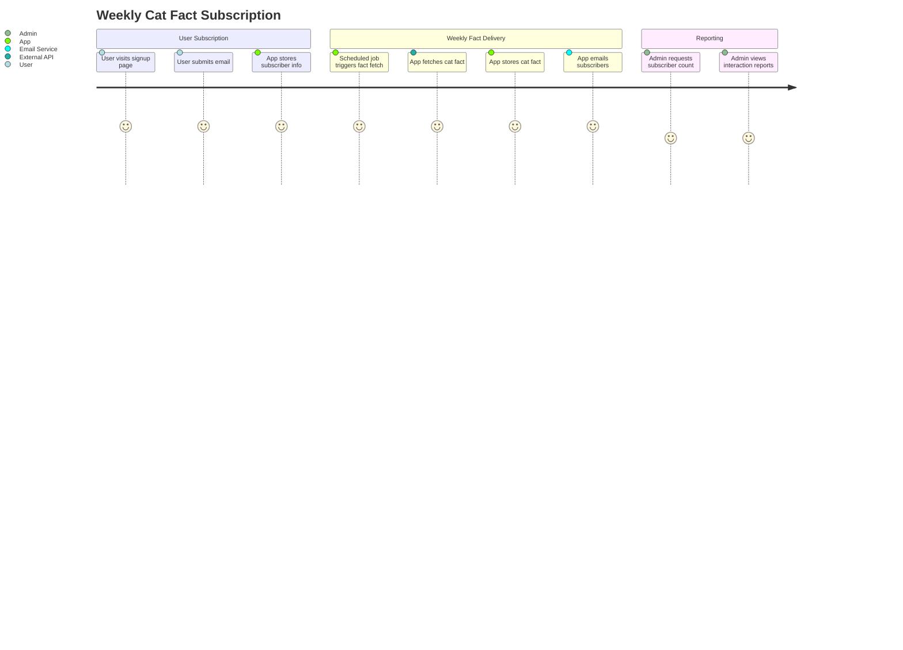

```markdown
# Functional Requirements and API Design for Weekly Cat Fact Subscription

## API Endpoints

### 1. User Subscription

- **POST /api/subscribe**  
  **Description:** Register a new subscriber with email (and optionally name).  
  **Request:**
  ```json
  {
    "email": "user@example.com",
    "name": "John Doe"  // optional
  }
  ```
  **Response:**
  ```json
  {
    "message": "Subscription successful",
    "subscriberId": "12345"
  }
  ```

### 2. Trigger Weekly Fact Retrieval and Email Send

- **POST /api/facts/sendWeekly**  
  **Description:** Fetch a new cat fact from external API, store it, and send to all subscribers.  
  **Request:** Empty body or optional override parameters.  
  ```json
  {}
  ```
  **Response:**
  ```json
  {
    "message": "Weekly cat fact retrieved and emails sent",
    "factId": "67890",
    "sentToSubscribers": 100
  }
  ```

### 3. Retrieve Stored Cat Facts

- **GET /api/facts**  
  **Description:** Get a list of stored cat facts with timestamps.  
  **Response:**
  ```json
  [
    {
      "factId": "67890",
      "fact": "Cats have five toes on their front paws, but only four toes on their back paws.",
      "timestamp": "2024-04-21T10:00:00Z"
    }
  ]
  ```

### 4. Reporting: Subscribers and Interactions

- **GET /api/report/subscribers**  
  **Description:** Get the number of subscribers.  
  **Response:**
  ```json
  {
    "totalSubscribers": 150
  }
  ```

- **GET /api/report/interactions**  
  **Description:** Get interactions such as emails sent and cat facts sent count.  
  **Response:**
  ```json
  {
    "factsSent": 10,
    "emailsSent": 150
  }
  ```

---

## Mermaid Sequence Diagram: User Subscription and Weekly Fact Send



---

## Mermaid User Journey Diagram: Weekly Cat Fact Subscription Flow


```