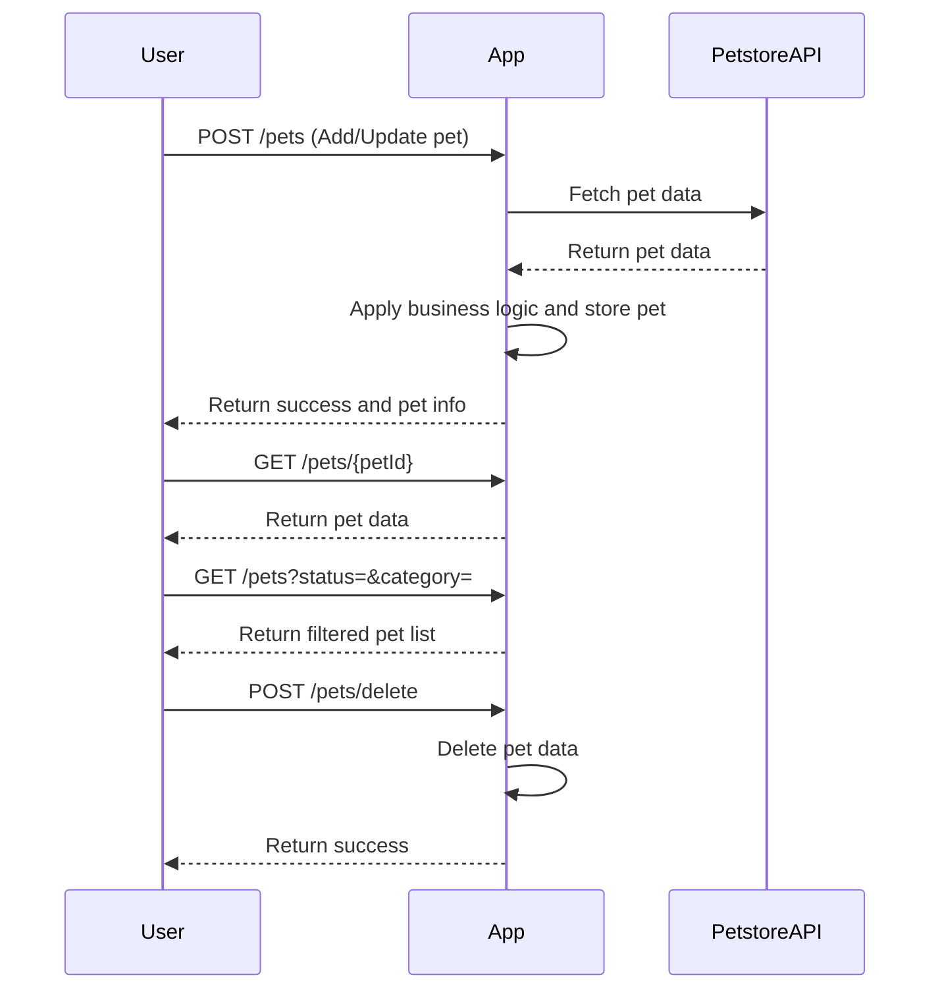

```markdown
# Purrfect Pets API - Functional Requirements

## API Endpoints

### 1. Add or Update Pet Data (POST /pets)
- **Purpose:** Fetch pet data from external Petstore API, apply any business logic or calculations, and store/update internally.
- **Request Body (JSON):**
  ```json
  {
    "petId": "string",         // Optional for new pet, required for update
    "name": "string",
    "category": "string",
    "status": "available|pending|sold",
    "tags": ["string"]
  }
  ```
- **Response (JSON):**
  ```json
  {
    "success": true,
    "pet": {
      "petId": "string",
      "name": "string",
      "category": "string",
      "status": "available|pending|sold",
      "tags": ["string"]
    }
  }
  ```

### 2. Retrieve Pet by ID (GET /pets/{petId})
- **Purpose:** Retrieve stored pet data by ID.
- **Response (JSON):**
  ```json
  {
    "petId": "string",
    "name": "string",
    "category": "string",
    "status": "available|pending|sold",
    "tags": ["string"]
  }
  ```

### 3. Search Pets (GET /pets?status=&category=)
- **Purpose:** Retrieve a list of pets filtered by status and/or category from internal storage.
- **Response (JSON):**
  ```json
  [
    {
      "petId": "string",
      "name": "string",
      "category": "string",
      "status": "available|pending|sold",
      "tags": ["string"]
    },
    ...
  ]
  ```

### 4. Delete Pet (POST /pets/delete)
- **Purpose:** Remove pet data internally.
- **Request Body (JSON):**
  ```json
  {
    "petId": "string"
  }
  ```
- **Response (JSON):**
  ```json
  {
    "success": true
  }
  ```

---

## User-App Interaction Sequence



---

## Summary

- POST endpoints handle external data retrieval and internal state changes.
- GET endpoints serve read-only access to internal data.
- JSON used for all requests and responses.
```