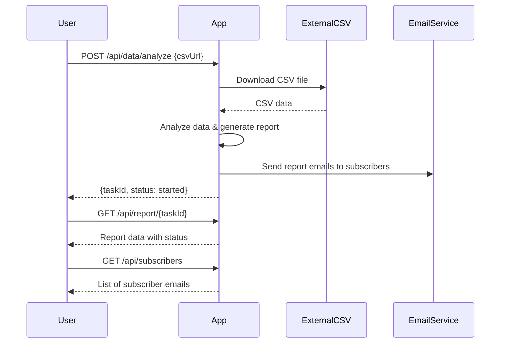

```markdown
# Functional Requirements and API Design

## API Endpoints

### 1. POST /api/data/analyze
- **Purpose:**  
  Trigger download of CSV data, perform analysis (summary statistics, trends), and generate a report.
- **Request Body:**  
  ```json
  {
    "csvUrl": "string"   // URL to download CSV file
  }
  ```
- **Response:**  
  ```json
  {
    "taskId": "string",     // Unique ID for the analysis task
    "status": "started"     // Indicates task started successfully
  }
  ```
- **Notes:**  
  This endpoint invokes external data retrieval and analysis. Report generation and email sending are triggered asynchronously.

---

### 2. GET /api/report/{taskId}
- **Purpose:**  
  Retrieve the analysis report and status for a given task.
- **Response:**  
  ```json
  {
    "taskId": "string",
    "status": "completed|pending|failed",
    "summaryStatistics": {
      "meanPrice": "number",
      "medianPrice": "number",
      "totalListings": "integer",
      "...": "..."
    },
    "basicTrends": {
      "priceTrend": "string",  // e.g., "increasing", "stable"
      "...": "..."
    },
    "emailSent": "boolean"
  }
  ```

---

### 3. GET /api/subscribers
- **Purpose:**  
  Retrieve static list of email subscribers.
- **Response:**  
  ```json
  {
    "subscribers": [
      "user1@example.com",
      "user2@example.com",
      "..."
    ]
  }
  ```

---

## Business Logic Summary
- POST `/api/data/analyze` downloads CSV from provided URL, performs analysis, generates a report, and sends emails to static subscribers.
- GET `/api/report/{taskId}` fetches the status and results of the analysis.
- GET `/api/subscribers` returns the static list of email recipients.

---

## User-App Interaction Sequence Diagram



---

## Example Copy-Paste Response

```
1. POST /api/data/analyze with CSV URL to start analysis and email report.
2. GET /api/report/{taskId} to retrieve analysis results and status.
3. GET /api/subscribers returns static email subscriber list.
```
```