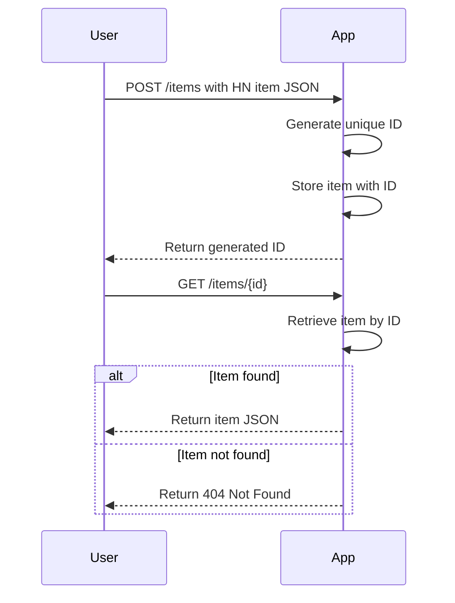

# Functional Requirements for Hacker News Item Service

## API Endpoints

### 1. POST `/items`
- **Purpose:** Store a Hacker News item in JSON format (as per Firebase HN API) and return a generated unique ID.
- **Request Body:** JSON representing the Hacker News item (stored as-is).
- **Response Body:** 
  ```json
  {
    "id": "generated-unique-id"
  }
  ```
- **Business Logic:** 
  - Generate a unique ID for the item.
  - Store the item associated with the generated ID.
  - Return the ID to the client.
  - Any external data retrieval or calculations (if needed) should be done here.

### 2. GET `/items/{id}`
- **Purpose:** Retrieve a stored Hacker News item by its unique ID.
- **Path Parameter:** `id` (string) - the unique identifier of the item.
- **Response Body:** JSON representing the stored Hacker News item.
- **Response Status:** 
  - `200 OK` with item JSON if found.
  - `404 Not Found` if no item with the given ID exists.
- **Business Logic:** 
  - Fetch the item from storage by ID.
  - Return the stored JSON as-is.
  - No external data fetching or calculations here.

---

## Request/Response Formats

### POST `/items` Example

**Request:**
```json
{
  "by": "pg",
  "descendants": 15,
  "id": 8863,
  "kids": [8952, 9224, 8917],
  "score": 111,
  "time": 1175714200,
  "title": "My YC app: Dropbox - Throw away your USB drive",
  "type": "story",
  "url": "http://www.getdropbox.com/u/2/screencast.html"
}
```

**Response:**
```json
{
  "id": "abc123xyz"
}
```

### GET `/items/abc123xyz` Example

**Response:**
```json
{
  "by": "pg",
  "descendants": 15,
  "id": 8863,
  "kids": [8952, 9224, 8917],
  "score": 111,
  "time": 1175714200,
  "title": "My YC app: Dropbox - Throw away your USB drive",
  "type": "story",
  "url": "http://www.getdropbox.com/u/2/screencast.html"
}
```

---

## User-App Interaction Sequence Diagram

