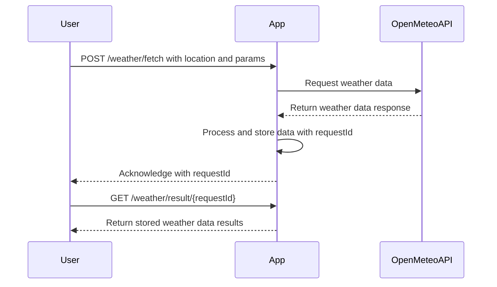
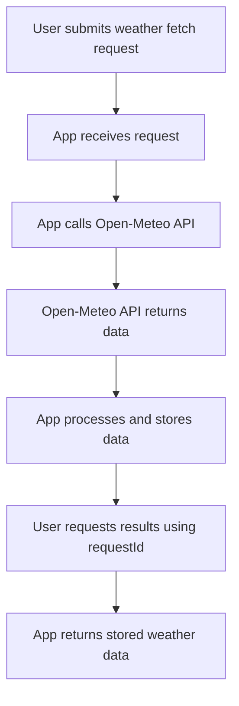

# Functional Requirements for Weather Data Fetching App

## API Endpoints

### 1. POST `/weather/fetch`
- **Description:** Trigger fetching weather data from the Open-Meteo API based on input parameters.
- **Request Body (JSON):**
  ```json
  {
    "latitude": 52.52,
    "longitude": 13.405,
    "start_date": "2024-04-20",       // optional, format YYYY-MM-DD
    "end_date": "2024-04-27",         // optional, format YYYY-MM-DD
    "parameters": ["temperature", "humidity", "wind_speed"]
  }
  ```
- **Response Body (JSON):**
  ```json
  {
    "status": "success",
    "message": "Weather data fetching triggered",
    "requestId": "uuid-1234-5678"
  }
  ```

### 2. GET `/weather/result/{requestId}`
- **Description:** Retrieve the weather data results for a previous fetch request by `requestId`.
- **Response Body (JSON):**
  ```json
  {
    "requestId": "uuid-1234-5678",
    "latitude": 52.52,
    "longitude": 13.405,
    "data": {
      "temperature": [15.0, 17.5, 16.2],
      "humidity": [75, 80, 78],
      "wind_speed": [5.5, 6.0, 4.8],
      "dates": ["2024-04-20", "2024-04-21", "2024-04-22"]
    }
  }
  ```

---

## Business Logic Summary
- The POST endpoint accepts parameters and triggers a workflow that calls the external Open-Meteo API.
- Data is processed and stored or cached linked to a unique `requestId`.
- The GET endpoint retrieves the processed results by `requestId`.

---

## User-App Interaction Sequence Diagram



---

## User Journey Diagram

