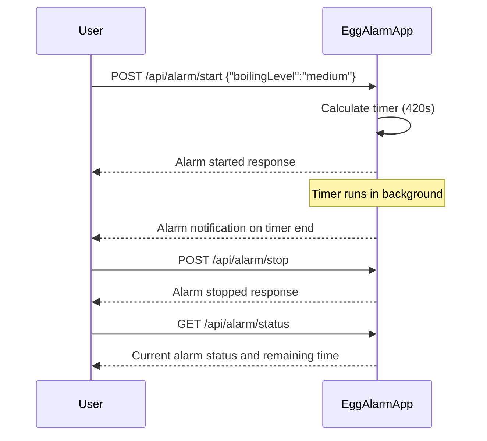

```markdown
# Egg Alarm - Functional Requirements & API Design

## Functional Requirements

1. User selects an egg boiling level: **soft-boiled**, **medium-boiled**, or **hard-boiled**.
2. User turns the alarm **ON** to start the timer based on the selected level.
3. The system calculates the timer duration corresponding to the selected level.
4. The system triggers an alarm notification when the timer ends.
5. User can **stop** or **reset** the alarm once started.
6. User can retrieve the current alarm status and remaining time.

---

## API Endpoints

### 1. Start Alarm (POST)

- **URL:** `/api/alarm/start`
- **Description:** Starts the alarm timer based on the selected boiling level.
- **Request Body:**
  ```json
  {
    "boilingLevel": "soft" | "medium" | "hard"
  }
  ```
- **Response:**
  ```json
  {
    "status": "started",
    "boilingLevel": "soft",
    "durationSeconds": 300,
    "startTime": "2024-06-01T12:00:00Z",
    "expectedEndTime": "2024-06-01T12:05:00Z"
  }
  ```

---

### 2. Stop Alarm (POST)

- **URL:** `/api/alarm/stop`
- **Description:** Stops the running alarm and resets timer.
- **Request Body:** `{}` (empty)
- **Response:**
  ```json
  {
    "status": "stopped"
  }
  ```

---

### 3. Get Alarm Status (GET)

- **URL:** `/api/alarm/status`
- **Description:** Retrieves current alarm status and remaining time.
- **Response:**
  ```json
  {
    "status": "running" | "stopped",
    "boilingLevel": "soft" | "medium" | "hard" | null,
    "remainingSeconds": 120 | 0,
    "expectedEndTime": "2024-06-01T12:05:00Z" | null
  }
  ```

---

## Timer Durations (Business Logic)

| Boiling Level | Duration (seconds) |
|---------------|--------------------|
| soft          | 300 (5 minutes)    |
| medium        | 420 (7 minutes)    |
| hard          | 600 (10 minutes)   |

---

## User-App Interaction Sequence Diagram


```