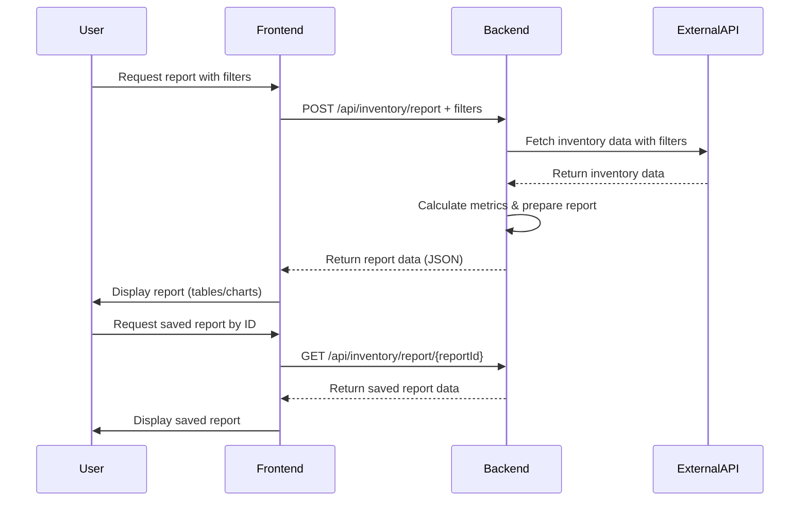

```markdown
# Functional Requirements for Inventory Reporting Application

## API Endpoints

### 1. POST `/api/inventory/report`
- **Description:**  
  Fetch inventory data from the external SwaggerHub API using provided filters, perform calculations (total number of items, average price, total value, etc.), and generate the report data.
- **Request Body:**  
```json
{
  "filters": {
    "category": "string",           // optional
    "dateFrom": "YYYY-MM-DD",       // optional
    "dateTo": "YYYY-MM-DD",         // optional
    "otherCriteria": "string"       // optional
  }
}
```
- **Response Body:**  
```json
{
  "totalItems": 100,
  "averagePrice": 25.5,
  "totalValue": 2550.0,
  "additionalStats": {
    "fieldName": "value"
  },
  "items": [
    {
      "id": "string",
      "name": "string",
      "category": "string",
      "price": 20.0,
      "quantity": 10,
      "otherFields": "..."
    }
  ]
}
```
- **Notes:**  
  - This endpoint triggers external API calls and data processing.
  - Returns processed data ready for frontend rendering.

---

### 2. GET `/api/inventory/report/{reportId}`
- **Description:**  
  Retrieve a previously generated report by its ID.
- **Response Body:**  
Same as POST `/api/inventory/report` response format.

---

## User-App Interaction Sequence



---

## Summary
- **POST** endpoint handles external data calls and processing.
- **GET** endpoint retrieves stored reports.
- Reports include key metrics and detailed items.
- Filters are optional and flexible.
```
