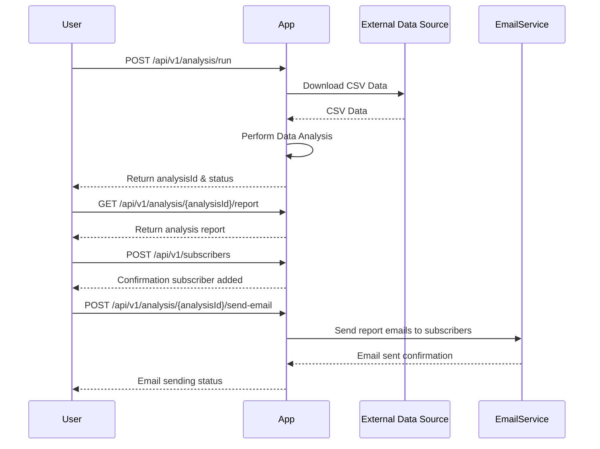
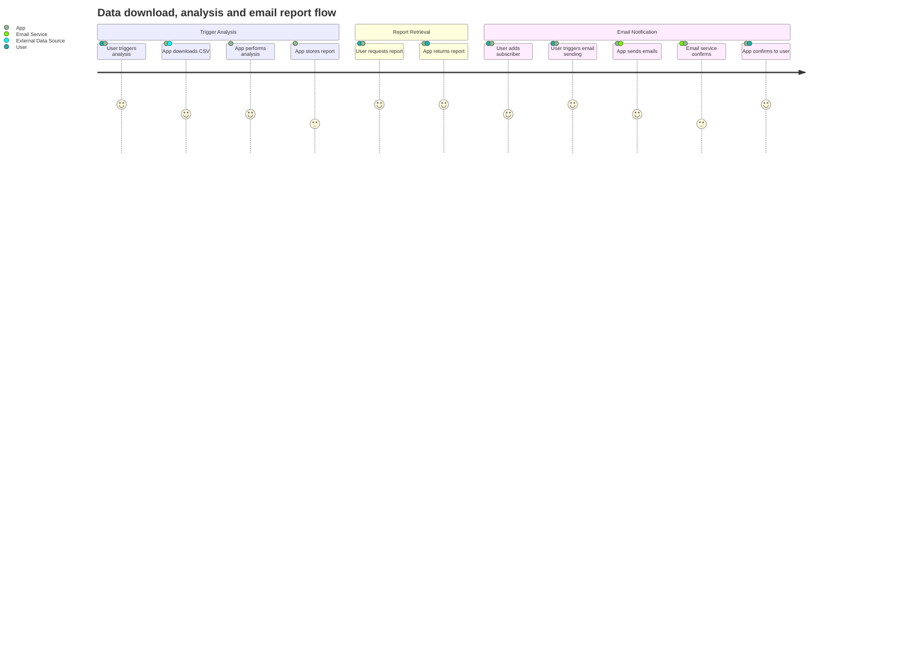

```markdown
# Functional Requirements and API Design

## API Endpoints

### 1. Trigger Data Download and Analysis  
**POST** `/api/v1/analysis/run`  
- **Description:** Downloads the CSV data from the external URL, performs analysis, and generates a report.  
- **Request Body:**  
```json
{
  "url": "string",          // Optional, defaults to the given CSV URL if omitted
  "analysisType": "string"  // Optional, e.g. "summary", "trend", defaults to "summary"
}
```  
- **Response:**  
```json
{
  "analysisId": "string",   // Unique ID for this analysis run
  "status": "string"        // e.g. "queued", "running", "completed"
}
```

---

### 2. Get Analysis Report  
**GET** `/api/v1/analysis/{analysisId}/report`  
- **Description:** Retrieves the generated report of a completed analysis by its ID.  
- **Response:**  
```json
{
  "analysisId": "string",
  "report": {
    "summaryStatistics": {  
      "meanPrice": "number",
      "medianPrice": "number",
      "totalListings": "number"
    },
    "generatedAt": "string"  // ISO8601 timestamp
  }
}
```

---

### 3. Manage Subscribers - Add Subscriber  
**POST** `/api/v1/subscribers`  
- **Description:** Add a new email subscriber to the mailing list.  
- **Request Body:**  
```json
{
  "email": "string"
}
```  
- **Response:**  
```json
{
  "subscriberId": "string",
  "email": "string",
  "status": "subscribed"
}
```

---

### 4. List Subscribers  
**GET** `/api/v1/subscribers`  
- **Description:** Retrieve the list of current subscribers.  
- **Response:**  
```json
[
  {
    "subscriberId": "string",
    "email": "string",
    "status": "string"
  }
]
```

---

### 5. Send Report Email  
**POST** `/api/v1/analysis/{analysisId}/send-email`  
- **Description:** Sends the generated report by email to all subscribers.  
- **Request Body:** *(optional)*  
```json
{
  "subject": "string",
  "message": "string"
}
```  
- **Response:**  
```json
{
  "emailStatus": "sent",
  "sentAt": "string"
}
```

---

## Mermaid Sequence Diagram: User-App Interaction



---

## Mermaid Journey Diagram: Data Analysis and Email Report Flow


```