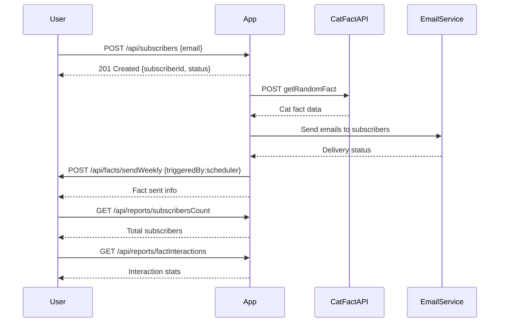

```markdown
# Weekly Cat Fact Subscription - Functional Requirements

## API Endpoints

### 1. User Subscription

- **POST /api/subscribers**
  - Description: Register a new subscriber with their email.
  - Request:
    ```json
    {
      "email": "user@example.com"
    }
    ```
  - Response:
    ```json
    {
      "subscriberId": "uuid",
      "email": "user@example.com",
      "status": "SUBSCRIBED"
    }
    ```

- **GET /api/subscribers**
  - Description: Retrieve a list of all subscribers.
  - Response:
    ```json
    [
      {
        "subscriberId": "uuid",
        "email": "user@example.com",
        "status": "SUBSCRIBED"
      }
    ]
    ```

### 2. Weekly Cat Fact Ingestion & Email Publishing

- **POST /api/facts/sendWeekly**
  - Description: Trigger data ingestion from Cat Fact API, store the fact, and send email to all subscribers.
  - Request:
    ```json
    {
      "triggeredBy": "scheduler"
    }
    ```
  - Response:
    ```json
    {
      "factId": "uuid",
      "factText": "Cats have five toes on their front paws.",
      "sentToSubscribers": 123
    }
    ```

### 3. Reporting & Interaction Tracking

- **GET /api/reports/subscribersCount**
  - Description: Retrieve the total number of subscribers.
  - Response:
    ```json
    {
      "totalSubscribers": 1234
    }
    ```

- **GET /api/reports/factInteractions**
  - Description: Retrieve interaction stats per fact (e.g., email opens, clicks).
  - Response:
    ```json
    [
      {
        "factId": "uuid",
        "sentDate": "2024-06-01T09:00:00Z",
        "emailsSent": 123,
        "emailsOpened": 100,
        "linksClicked": 25
      }
    ]
    ```

---

## User-App Interaction Sequence Diagram


```