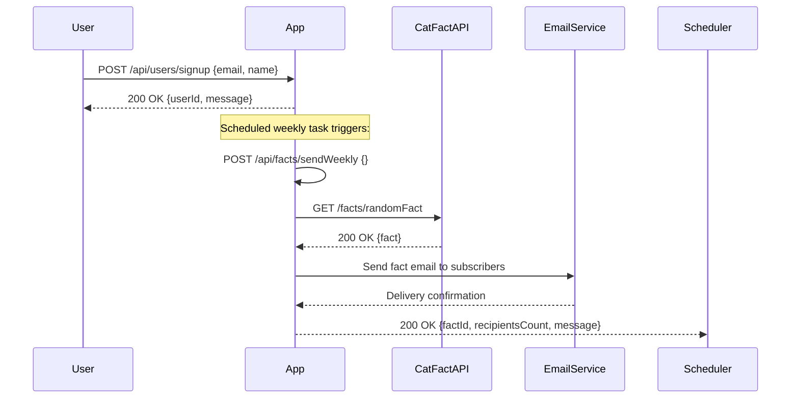
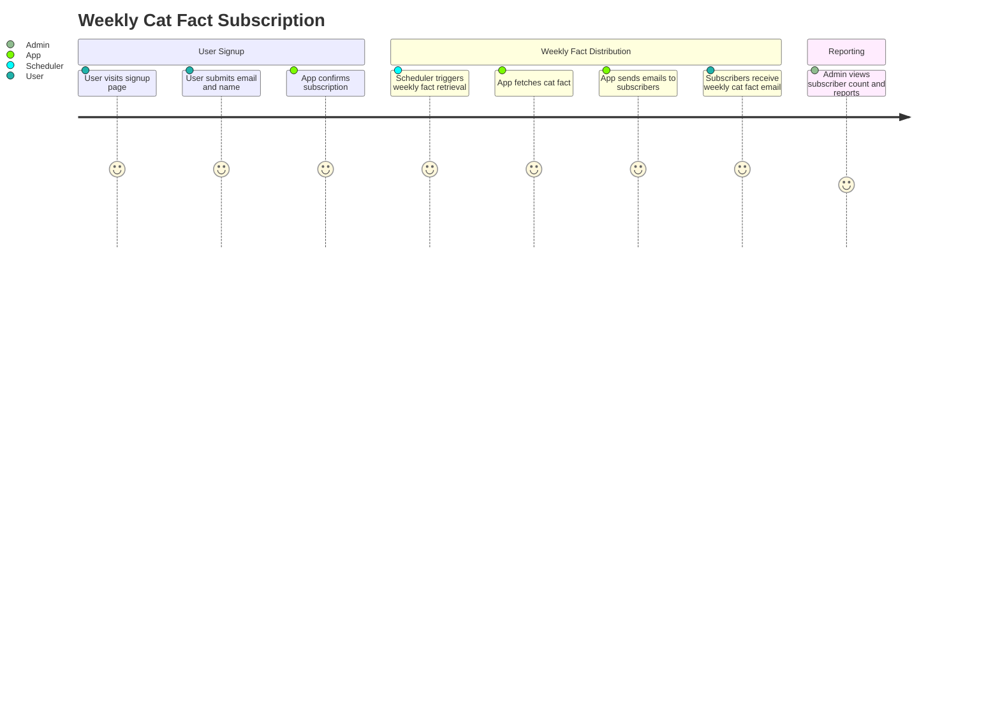

# Weekly Cat Fact Subscription - Functional Requirements and API Design

## Functional Requirements & API Endpoints

### 1. User Sign-Up  
**POST /api/users/signup**  
- **Description**: Registers a new subscriber with their email (and optionally name).  
- **Request**:  
```json
{
  "email": "user@example.com",
  "name": "Optional User Name"
}
```  
- **Response**:  
```json
{
  "userId": "string",
  "message": "Subscription successful."
}
```

### 2. Trigger Weekly Cat Fact Ingestion and Email Sending  
**POST /api/facts/sendWeekly**  
- **Description**: Manually triggers retrieval of a new cat fact from the external API and sends it via email to all subscribers. This is also the endpoint the scheduler will call once a week.  
- **Request**: Empty body `{}`  
- **Response**:  
```json
{
  "factId": "string",
  "factText": "string",
  "recipientsCount": 123,
  "message": "Weekly cat fact sent successfully."
}
```

### 3. Retrieve All Subscribers  
**GET /api/users**  
- **Description**: Retrieves a list of all subscribers (emails and optionally names).  
- **Response**:  
```json
[
  {
    "userId": "string",
    "email": "user@example.com",
    "name": "Optional User Name"
  }
]
```

### 4. Retrieve Weekly Facts History  
**GET /api/facts/history**  
- **Description**: Retrieves a list of previously sent cat facts with timestamps and number of recipients.  
- **Response**:  
```json
[
  {
    "factId": "string",
    "factText": "string",
    "sentAt": "2024-04-20T09:00:00Z",
    "recipientsCount": 123
  }
]
```

### 5. Reporting - Subscriber Count and Interaction Metrics  
**GET /api/report/summary**  
- **Description**: Provides summary metrics such as total subscribers and total emails sent.  
- **Response**:  
```json
{
  "totalSubscribers": 1234,
  "totalEmailsSent": 56,
  "lastFactSentAt": "2024-04-20T09:00:00Z"
}
```

---

## Mermaid Sequence Diagram: User Sign-Up and Weekly Fact Sending



---

## Mermaid User Journey Diagram: Weekly Cat Fact Subscription Flow

