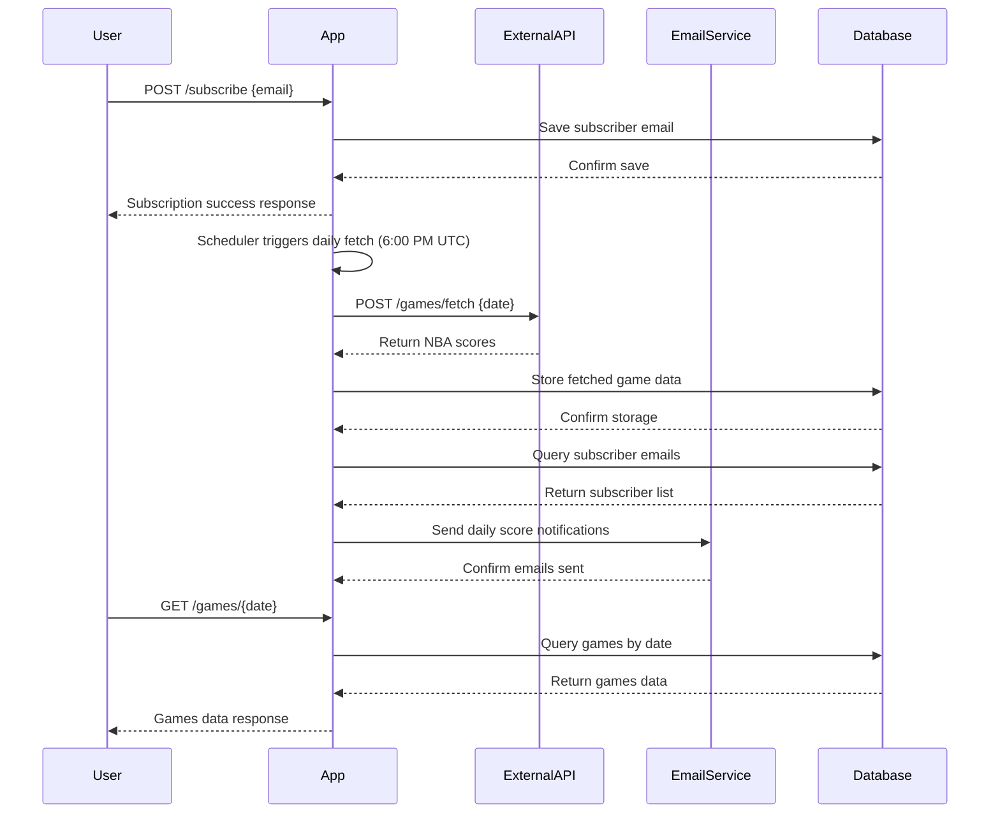

```markdown
# Functional Requirements

## 1. Fetching Data
- The system fetches NBA game score data daily at a scheduled time (e.g., 6:00 PM UTC).
- Data is fetched asynchronously from the external API:
  ```
  GET https://api.sportsdata.io/v3/nba/scores/json/ScoresBasicFinal/{today}?key=test
  ```
- The `{today}` parameter uses the format `YYYY-MM-DD`.
- Fetching, storing, and notifying are triggered by a background scheduler without user API calls.

## 2. Data Storage
- Persist all fetched NBA game data locally.
- Store game details including:
  - Game date
  - Home and away team names
  - Scores
  - Additional relevant game information

## 3. Subscription System
- Users can subscribe with their email to receive daily NBA score notifications.
- Subscription endpoint accepts user emails and stores them.
- No unsubscribe or validation required at this stage.

## 4. Notification System
- After data fetch and storage, send email notifications to all subscribers.
- Notifications contain a plain-text summary of all games played on the fetched date.

## 5. API Endpoints

| Method | Endpoint           | Description                                         | Request Body / Parameters                             | Response Example                              |
|--------|--------------------|-----------------------------------------------------|------------------------------------------------------|-----------------------------------------------|
| POST   | `/subscribe`       | Add user email to subscription list                 | `{ "email": "user@example.com" }`                    | `{ "message": "Subscription successful", "email": "user@example.com" }` |
| POST   | `/games/fetch`     | Trigger fetch, store, and notify for given date     | `{ "date": "YYYY-MM-DD" }`                           | `{ "message": "Scores fetched, saved, and notifications sent", "date": "YYYY-MM-DD", "gamesCount": 15 }` |
| GET    | `/subscribers`     | Retrieve all subscribed emails                        | None                                                 | `{ "subscribers": ["user1@example.com", "user2@example.com"] }` |
| GET    | `/games/all`       | Retrieve all stored games (supports pagination)      | Query params: `page`, `size` (optional)              | List of all games with pagination metadata    |
| GET    | `/games/{date}`    | Retrieve all games for a specific date                | Path param: `date` (format `YYYY-MM-DD`)              | Games played on the specified date             |

---

## User-App Interaction Sequence


```