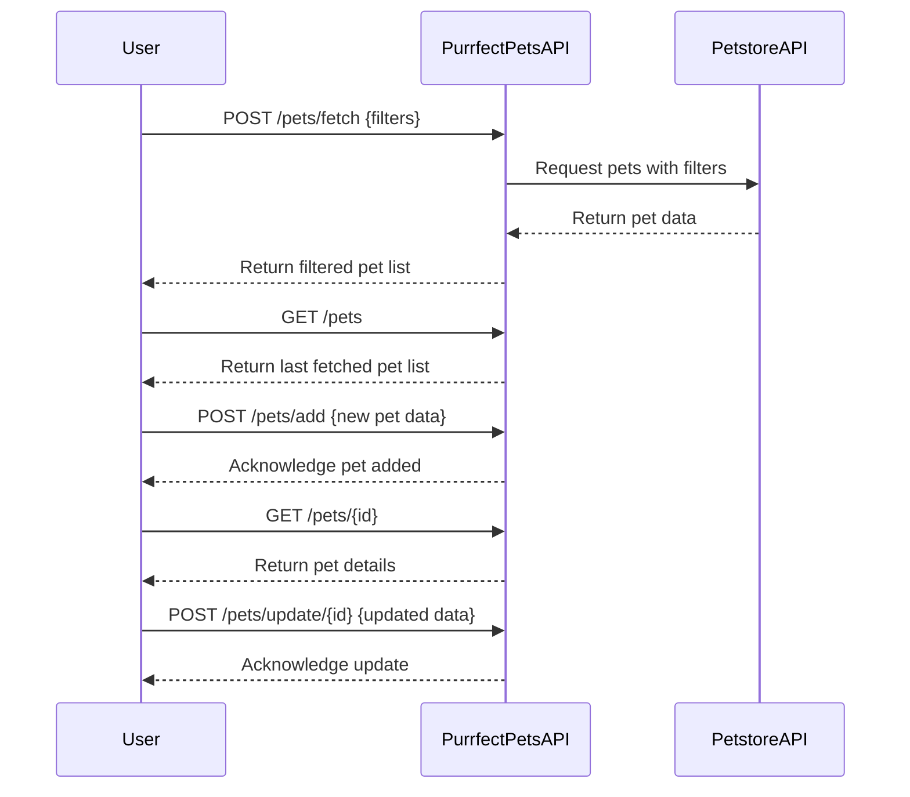

```markdown
# Purrfect Pets API - Functional Requirements

## API Endpoints

### 1. POST /pets/fetch
- **Description:** Fetch pet data from the external Petstore API based on filters or criteria. This endpoint triggers the external data retrieval and any business logic.
- **Request Body:**
```json
{
  "type": "string",         // optional, e.g., "dog", "cat"
  "status": "string",       // optional, e.g., "available", "sold"
  "name": "string"          // optional, partial or full name filter
}
```
- **Response Body:**
```json
{
  "pets": [
    {
      "id": "integer",
      "name": "string",
      "type": "string",
      "status": "string",
      "age": "integer",
      "description": "string"
    }
  ]
}
```

### 2. GET /pets
- **Description:** Retrieve the list of pets last fetched or stored in the application.
- **Response Body:**
```json
{
  "pets": [
    {
      "id": "integer",
      "name": "string",
      "type": "string",
      "status": "string",
      "age": "integer",
      "description": "string"
    }
  ]
}
```

### 3. POST /pets/add
- **Description:** Add a new pet to the system.
- **Request Body:**
```json
{
  "name": "string",
  "type": "string",
  "status": "string",
  "age": "integer",
  "description": "string"
}
```
- **Response Body:**
```json
{
  "message": "Pet added successfully",
  "petId": "integer"
}
```

### 4. GET /pets/{id}
- **Description:** Retrieve pet details by ID.
- **Response Body:**
```json
{
  "id": "integer",
  "name": "string",
  "type": "string",
  "status": "string",
  "age": "integer",
  "description": "string"
}
```

### 5. POST /pets/update/{id}
- **Description:** Update pet details by ID.
- **Request Body:**
```json
{
  "name": "string",         // optional
  "type": "string",         // optional
  "status": "string",       // optional
  "age": "integer",         // optional
  "description": "string"   // optional
}
```
- **Response Body:**
```json
{
  "message": "Pet updated successfully"
}
```

---

## User-App Interaction (Sequence Diagram)


```