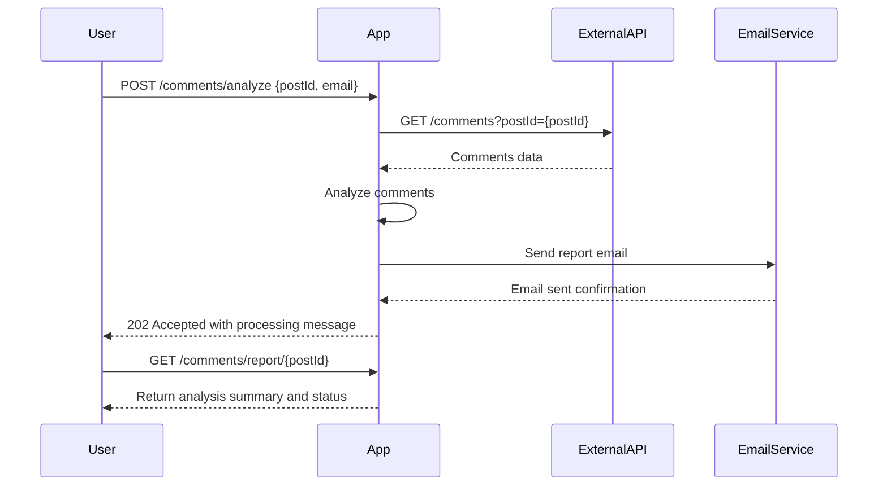

```markdown
# Functional Requirements for Comments Analysis Application

## API Endpoints

### 1. POST `/comments/analyze`
- **Description**: Ingest comments for a given `postId` from external API, analyze them, generate a report, and send it via email.
- **Request Body** (JSON):
  ```json
  {
    "postId": 1,
    "email": "user@example.com"
  }
  ```
- **Response** (JSON):
  ```json
  {
    "status": "processing",
    "message": "Analysis started for postId 1, report will be sent to user@example.com"
  }
  ```
- **Business Logic**:
  - Fetch comments from `https://jsonplaceholder.typicode.com/comments?postId={postId}`
  - Perform comment analysis (e.g., sentiment, counts)
  - Generate report
  - Send report to provided email
  - Store analysis metadata for retrieval

---

### 2. GET `/comments/report/{postId}`
- **Description**: Retrieve latest analysis report summary for the specified `postId`.
- **Response** (JSON):
  ```json
  {
    "postId": 1,
    "analysisStatus": "completed",
    "summary": {
      "totalComments": 5,
      "positiveComments": 3,
      "negativeComments": 1,
      "neutralComments": 1
    },
    "reportSentTo": "user@example.com",
    "lastUpdated": "2024-06-01T12:34:56Z"
  }
  ```

---

## User-App Interaction Sequence


```