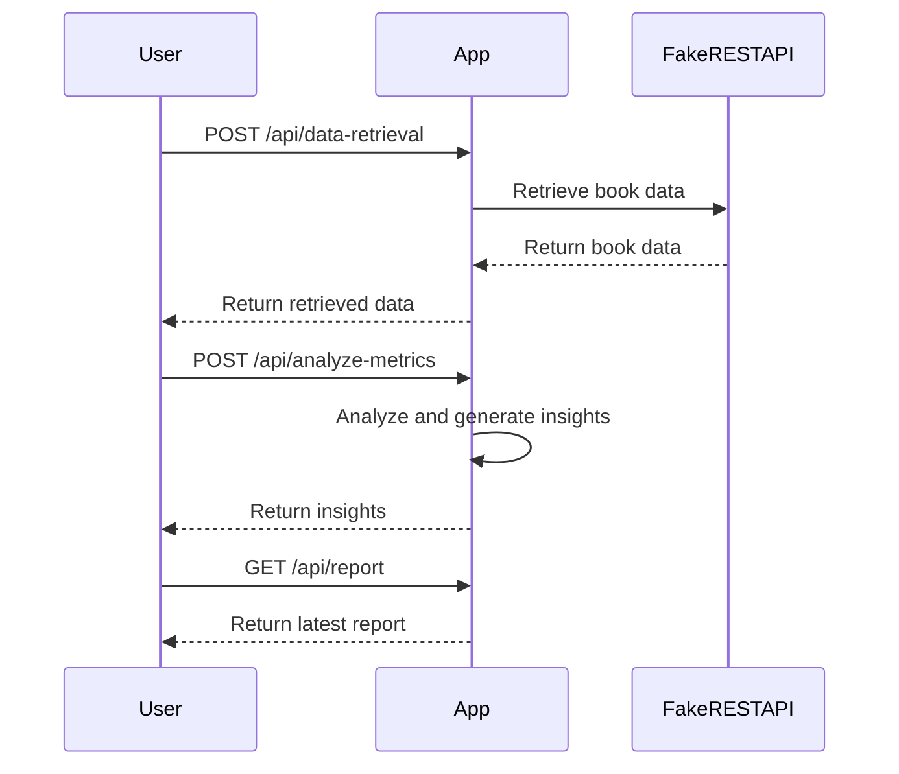

# Finalized Functional Requirements for Book Data Analysis Application

## API Endpoints

1. **POST /api/data-retrieval**
   - **Purpose**: Retrieve book data from the Fake REST API.
   - **Request Format**: 
     ```json
     {
       "apiEndpoint": "https://fakerestapi.azurewebsites.net/api/v1/Books",
       "parameters": {}
     }
     ```
   - **Response Format**: 
     ```json
     {
       "status": "success",
       "data": [
         {
           "id": 1,
           "title": "Book Title",
           "description": "Book Description",
           "pageCount": 123,
           "excerpt": "Book Excerpt",
           "publishDate": "2023-01-01T00:00:00"
         }
       ]
     }
     ```

2. **POST /api/analyze-metrics**
   - **Purpose**: Analyze book data and generate insights.
   - **Request Format**: 
     ```json
     {
       "books": [
         {
           "id": 1,
           "title": "Book Title",
           "description": "Book Description",
           "pageCount": 123,
           "excerpt": "Book Excerpt",
           "publishDate": "2023-01-01T00:00:00"
         }
       ]
     }
     ```
   - **Response Format**: 
     ```json
     {
       "status": "success",
       "insights": {
         "totalBooks": 100,
         "totalPageCount": 12345,
         "popularTitles": [
           {
             "title": "Popular Book Title",
             "description": "Brief Description",
             "excerpt": "Excerpt of the Book"
           }
         ]
       }
     }
     ```

3. **GET /api/report**
   - **Purpose**: Retrieve the latest summary report.
   - **Response Format**: 
     ```json
     {
       "status": "success",
       "report": {
         "generatedOn": "2023-01-08T12:00:00",
         "content": "Report content in desired format"
       }
     }
     ```

## User-App Interaction Diagram



This finalized version reflects the functional requirements you've confirmed. If there are any further adjustments or enhancements needed, feel free to let me know!