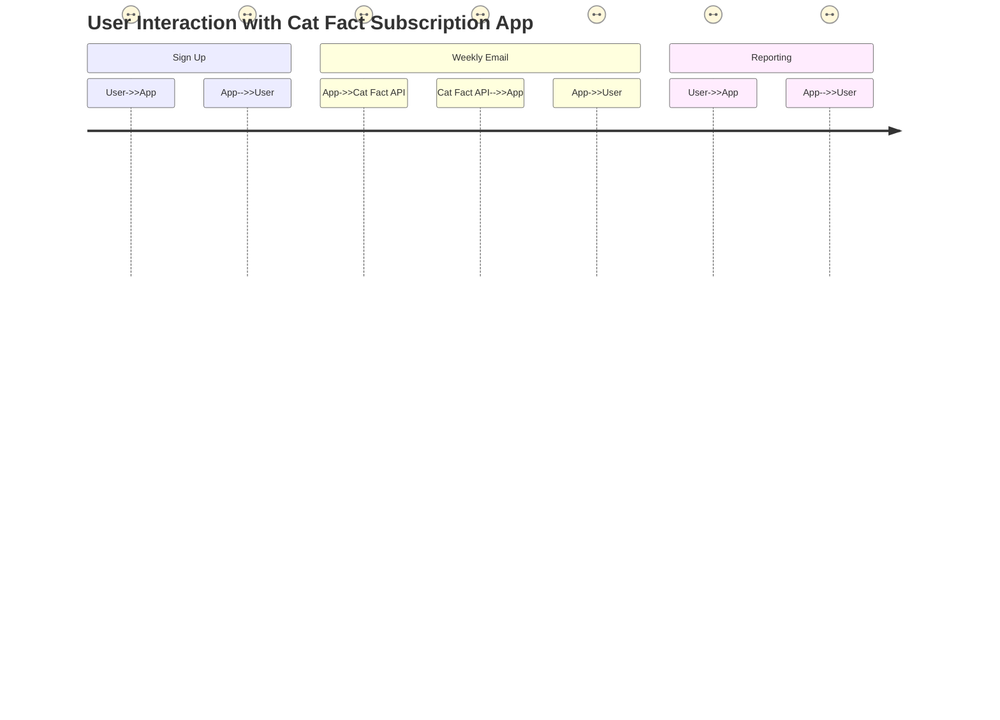

Certainly! Here is the well-formatted final version of the functional requirements, based on the user confirmation:

# Functional Requirements for Weekly Cat Fact Subscription

## API Endpoints

### 1. User Sign-up
- **POST /api/signup**
  - **Request Body**:
    ```json
    {
      "email": "user@example.com",
      "name": "John Doe"
    }
    ```
  - **Response**:
    - **201 Created**
    ```json
    {
      "message": "User successfully signed up",
      "userId": "12345"
    }
    ```

### 2. Retrieve Cat Fact
- **POST /api/catfact**
  - **Request Body**: None
  - **Response**:
    - **200 OK**
    ```json
    {
      "fact": "Cats can rotate their ears 180 degrees."
    }
    ```

### 3. Send Weekly Email
- **POST /api/sendWeeklyEmail**
  - **Request Body**: None
  - **Response**:
    - **200 OK**
    ```json
    {
      "message": "Weekly emails sent to all subscribers"
    }
    ```

### 4. Get Subscriber Stats
- **GET /api/stats/subscribers**
  - **Response**:
    - **200 OK**
    ```json
    {
      "totalSubscribers": 150,
      "weeklyInteractions": {
        "opens": 120,
        "clicks": 80
      }
    }
    ```

## User-App Interaction Diagram



This concludes the finalized version of the functional requirements for the Weekly Cat Fact Subscription application. Feel free to make additional adjustments as needed!