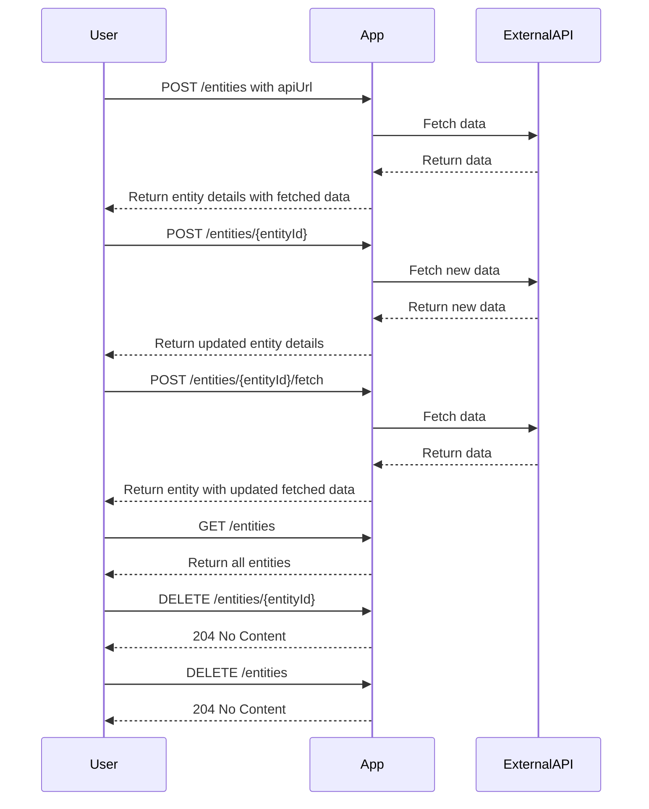
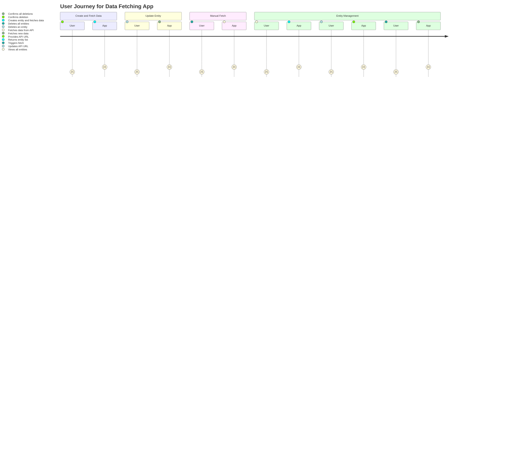

# Confirmed Functional Requirements for Data Fetching Application

## API Endpoints

1. **Create Entity**
   - **Endpoint**: `POST /entities`
   - **Request**:
     ```json
     {
       "apiUrl": "https://external.api/data"
     }
     ```
   - **Response**:
     ```json
     {
       "entityId": "12345",
       "apiUrl": "https://external.api/data",
       "fetchedData": null,
       "fetchedAt": null
     }
     ```
   - **Description**: Creates a new entity with the provided API URL. Automatically triggers data fetching.

2. **Update Entity**
   - **Endpoint**: `POST /entities/{entityId}`
   - **Request**:
     ```json
     {
       "apiUrl": "https://new.api/data"
     }
     ```
   - **Response**:
     ```json
     {
       "entityId": "12345",
       "apiUrl": "https://new.api/data",
       "fetchedData": "...",
       "fetchedAt": "2023-10-01T12:00:00Z"
     }
     ```
   - **Description**: Updates the entity's API URL and automatically triggers data fetching.

3. **Manual Data Fetching**
   - **Endpoint**: `POST /entities/{entityId}/fetch`
   - **Request**: No body required
   - **Response**:
     ```json
     {
       "entityId": "12345",
       "fetchedData": "...",
       "fetchedAt": "2023-10-01T12:00:00Z"
     }
     ```
   - **Description**: Manually triggers data fetching for the specified entity.

4. **Get All Entities**
   - **Endpoint**: `GET /entities`
   - **Response**:
     ```json
     [
       {
         "entityId": "12345",
         "apiUrl": "https://external.api/data",
         "fetchedData": "...",
         "fetchedAt": "2023-10-01T12:00:00Z"
       },
       ...
     ]
     ```
   - **Description**: Retrieves all entities with their details.

5. **Delete Single Entity**
   - **Endpoint**: `DELETE /entities/{entityId}`
   - **Response**: `204 No Content`
   - **Description**: Deletes the specified entity.

6. **Delete All Entities**
   - **Endpoint**: `DELETE /entities`
   - **Response**: `204 No Content`
   - **Description**: Deletes all entities.

## User-App Interaction



