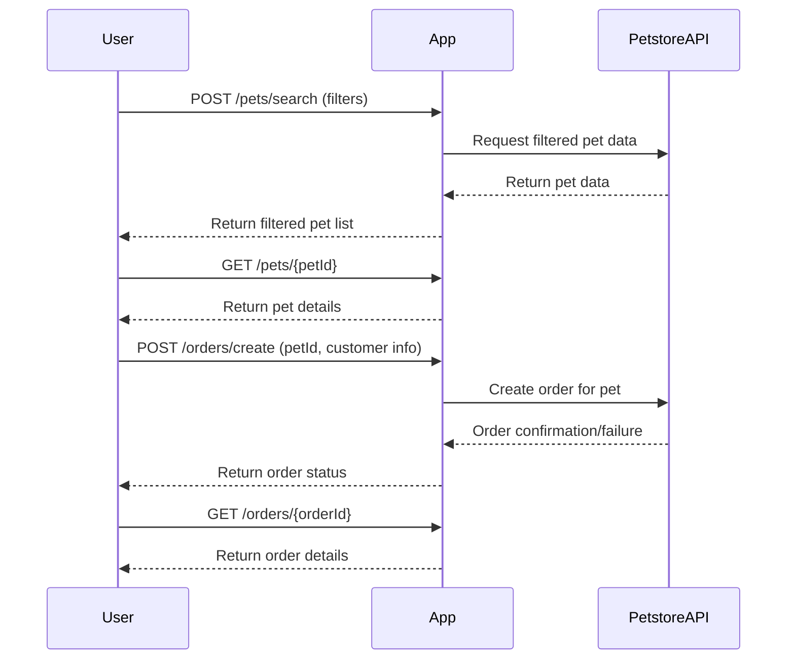

# Functional Requirements for "Purrfect Pets" API App

## API Endpoints

### 1. POST /pets/search  
**Description:** Search and filter pets from Petstore API data (invokes external data source)  
**Request:**  
```json
{
  "species": "string (optional)",
  "ageRange": { "min": "integer", "max": "integer" } (optional),
  "availability": "available" | "sold" (optional),
  "nameContains": "string (optional)"
}
```  
**Response:**  
```json
{
  "pets": [
    {
      "id": "string",
      "name": "string",
      "species": "string",
      "age": "integer",
      "status": "available" | "sold",
      "description": "string"
    }
  ]
}
```

---

### 2. POST /orders/create  
**Description:** Place an order for a pet (invokes external data source)  
**Request:**  
```json
{
  "petId": "string",
  "customerName": "string",
  "customerContact": "string"
}
```  
**Response:**  
```json
{
  "orderId": "string",
  "status": "confirmed" | "failed",
  "message": "string"
}
```

---

### 3. GET /pets/{petId}  
**Description:** Retrieve details of a specific pet (local app data)  
**Response:**  
```json
{
  "id": "string",
  "name": "string",
  "species": "string",
  "age": "integer",
  "status": "available" | "sold",
  "description": "string"
}
```

---

### 4. GET /orders/{orderId}  
**Description:** Retrieve order status and details (local app data)  
**Response:**  
```json
{
  "orderId": "string",
  "petId": "string",
  "customerName": "string",
  "status": "confirmed" | "failed"
}
```

---

## User-App Interaction Sequence



---

If you want to refine or add features, just let me know!