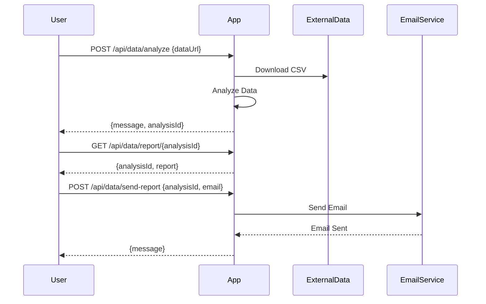

Certainly! Here are the confirmed and well-formatted functional requirements for your Java Spring Boot application:

# Functional Requirements for the Java Spring Boot Application

## API Endpoints

### 1. Download and Analyze Data
- **Endpoint:** `/api/data/analyze`
- **Method:** `POST`
- **Description:** Downloads data from the provided URL, performs analysis, and stores the results.
- **Request Format:**
  - Content-Type: `application/json`
  - Body:
    ```json
    {
      "dataUrl": "https://raw.githubusercontent.com/Cyoda-platform/cyoda-ai/refs/heads/ai-2.x/data/test-inputs/v1/connections/london_houses.csv"
    }
    ```
- **Response Format:**
  - Status: `200 OK` on success
  - Body:
    ```json
    {
      "message": "Data analyzed successfully",
      "analysisId": "12345"
    }
    ```

### 2. Retrieve Analysis Report
- **Endpoint:** `/api/data/report/{analysisId}`
- **Method:** `GET`
- **Description:** Retrieves the analysis report for the specified analysis ID.
- **Response Format:**
  - Status: `200 OK` on success
  - Body:
    ```json
    {
      "analysisId": "12345",
      "report": "Analysis report content here"
    }
    ```

### 3. Send Report via Email
- **Endpoint:** `/api/data/send-report`
- **Method:** `POST`
- **Description:** Sends the analysis report to subscribers via email.
- **Request Format:**
  - Content-Type: `application/json`
  - Body:
    ```json
    {
      "analysisId": "12345",
      "email": "subscriber@example.com"
    }
    ```
- **Response Format:**
  - Status: `200 OK` on success
  - Body:
    ```json
    {
      "message": "Report sent successfully"
    }
    ```

## User-App Interaction Diagram



Feel free to let me know if there are any more adjustments or additions you'd like to make!