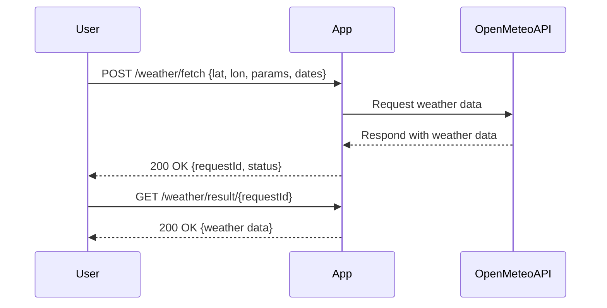
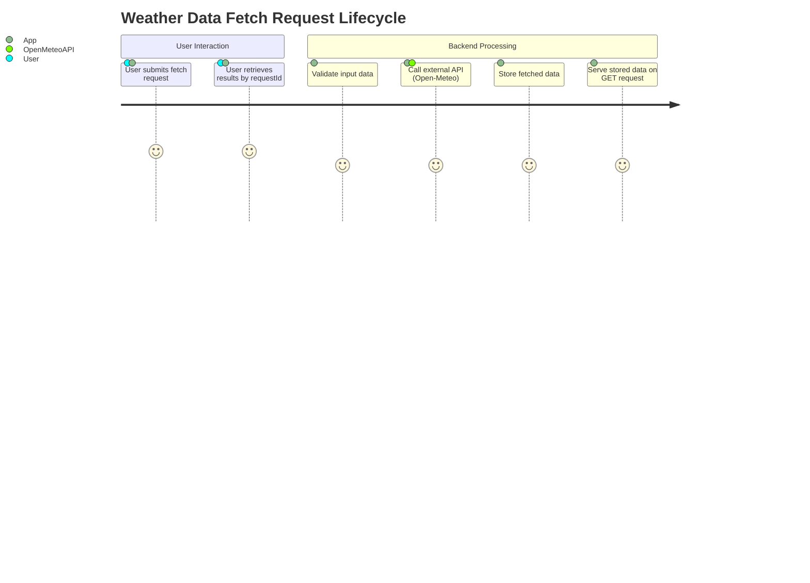

# Functional Requirements for Weather Data Fetching Application

## API Endpoints

### 1. POST /weather/fetch
- **Description:** Fetch weather data from Open-Meteo API based on provided location and parameters.
- **Request Body (JSON):**
  ```json
  {
    "latitude": 52.52,
    "longitude": 13.405,
    "parameters": ["temperature_2m", "precipitation"],
    "start_date": "2024-06-01",
    "end_date": "2024-06-02"
  }
  ```
- **Response Body (JSON):**
  ```json
  {
    "requestId": "uuid-generated-id",
    "status": "success",
    "fetchedAt": "2024-06-01T12:00:00Z"
  }
  ```
- **Behavior:**  
  - Validates input data.
  - Calls Open-Meteo API with given parameters.
  - Stores or caches fetched data in the app.
  - Returns a request ID for later retrieval.

---

### 2. GET /weather/result/{requestId}
- **Description:** Retrieve previously fetched weather data by request ID.
- **Path Parameter:**  
  - `requestId` (string) - ID returned by the POST /weather/fetch endpoint.
- **Response Body (JSON):**
  ```json
  {
    "requestId": "uuid-generated-id",
    "latitude": 52.52,
    "longitude": 13.405,
    "parameters": ["temperature_2m", "precipitation"],
    "data": {
      "temperature_2m": [20.1, 21.3, 19.8],
      "precipitation": [0.0, 0.2, 0.0]
    },
    "fetchedAt": "2024-06-01T12:00:00Z"
  }
  ```
- **Behavior:**  
  - Returns stored weather data for the given request ID.
  - Returns HTTP 404 if no data found.

---

# Mermaid Sequence Diagram: User-App Interaction



---

# Mermaid Journey Diagram: Request Lifecycle

