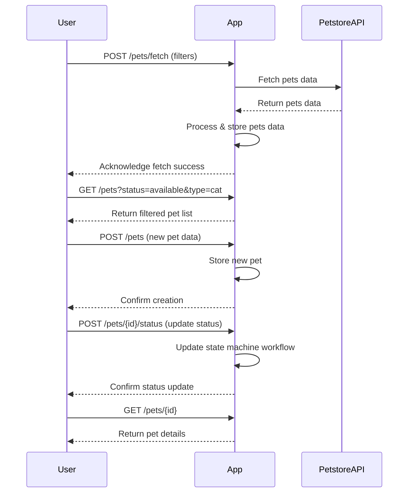

```markdown
# Purrfect Pets API - Functional Requirements

## Overview
The 'Purrfect Pets' API app integrates with the Petstore API data to provide pet-related services. It follows RESTful conventions with:

- **POST** endpoints to invoke business logic, fetch or calculate data (including external Petstore API calls).
- **GET** endpoints to retrieve stored or processed results from our application.

---

## API Endpoints

### 1. Add or Update Pet Data (Fetch from Petstore API & Store)

- **POST** `/pets/fetch`
- **Description:** Fetch pet data from the external Petstore API based on filters, process it, and store it in the app.
- **Request:**
  ```json
  {
    "status": "available|pending|sold",    // optional filter
    "type": "cat|dog|bird|..."             // optional pet type filter
  }
  ```
- **Response:**
  ```json
  {
    "message": "Pets data fetched and stored successfully",
    "count": 12
  }
  ```

---

### 2. Create a New Pet Record (User adds a pet)

- **POST** `/pets`
- **Description:** Add a new pet manually to the system.
- **Request:**
  ```json
  {
    "name": "Whiskers",
    "type": "cat",
    "status": "available",
    "age": 2,
    "description": "Playful kitten"
  }
  ```
- **Response:**
  ```json
  {
    "id": 101,
    "message": "Pet created successfully"
  }
  ```

---

### 3. Update Pet Status (e.g., adoption workflow trigger)

- **POST** `/pets/{id}/status`
- **Description:** Update status of a pet, triggering workflows (e.g., adoption).
- **Request:**
  ```json
  {
    "status": "sold|pending|available"
  }
  ```
- **Response:**
  ```json
  {
    "id": 101,
    "oldStatus": "available",
    "newStatus": "sold",
    "message": "Pet status updated"
  }
  ```

---

### 4. Retrieve Pets List (Filtered)

- **GET** `/pets`
- **Description:** Get a list of pets stored in the app, optionally filtered.
- **Query Parameters:** `status`, `type`
- **Response:**
  ```json
  [
    {
      "id": 101,
      "name": "Whiskers",
      "type": "cat",
      "status": "available",
      "age": 2,
      "description": "Playful kitten"
    },
    ...
  ]
  ```

---

### 5. Retrieve Single Pet Details

- **GET** `/pets/{id}`
- **Description:** Get detailed information for a single pet.
- **Response:**
  ```json
  {
    "id": 101,
    "name": "Whiskers",
    "type": "cat",
    "status": "available",
    "age": 2,
    "description": "Playful kitten"
  }
  ```

---

## Business Logic Notes

- All calls to the external Petstore API happen inside the **POST** `/pets/fetch` endpoint.
- Pet status updates trigger workflows using Cyoda state machines.
- Data storage is internal to the app for retrieval via GET endpoints.

---

## User-App Interaction Sequence


```