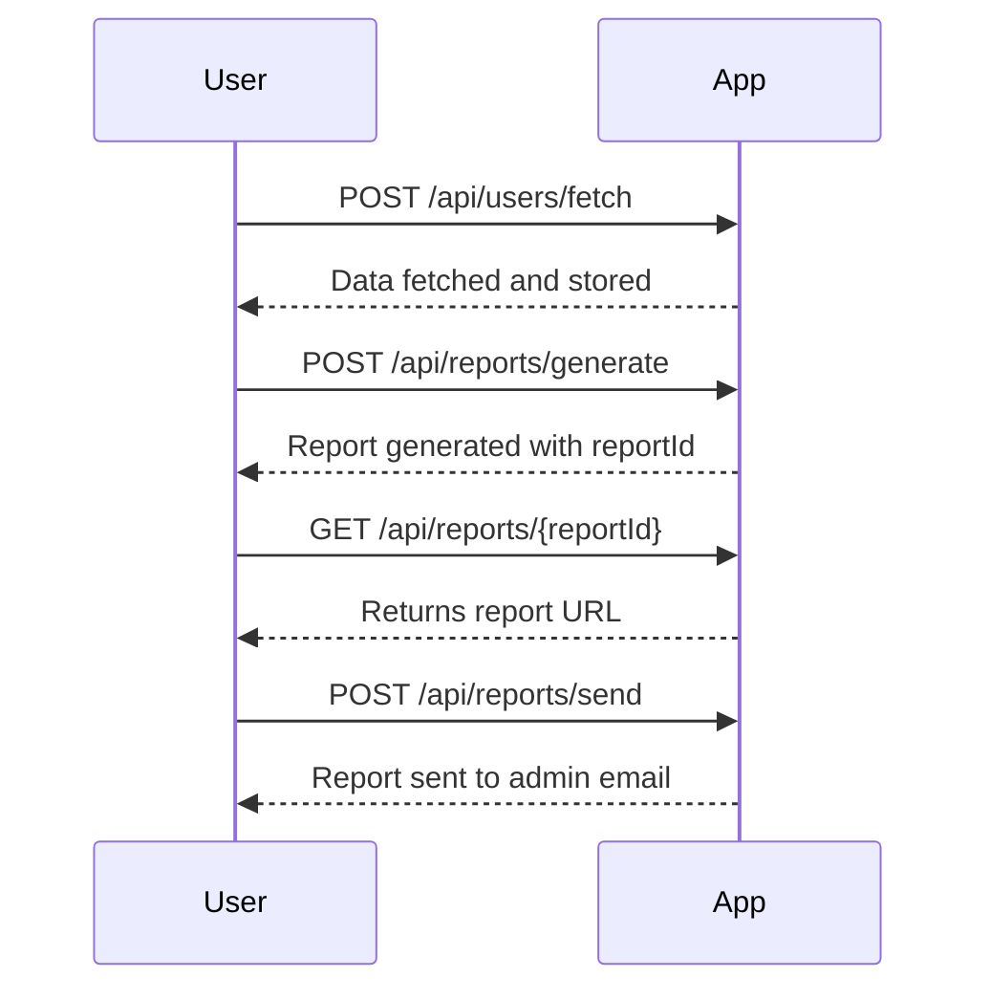

# Final Functional Requirements for Batch Processing Application

## API Endpoints

### 1. Fetch and Store User Data
- **Endpoint**: `/api/users/fetch`
- **Method**: `POST`
- **Description**: Fetches a list of users from the Fakerest API and stores the transformed data in the cloud database.
- **Request Format**:
  ```json
  {
    "apiUrl": "https://fakerestapi.azurewebsites.net/api/v1/Users"
  }
  ```
- **Response Format**:
  ```json
  {
    "status": "success",
    "message": "Data fetched and stored successfully"
  }
  ```

### 2. Generate Monthly Report
- **Endpoint**: `/api/reports/generate`
- **Method**: `POST`
- **Description**: Generates a monthly report from the stored user data.
- **Request Format**:
  ```json
  {
    "month": "2023-10"
  }
  ```
- **Response Format**:
  ```json
  {
    "status": "success",
    "reportId": "12345"
  }
  ```

### 3. Retrieve Report
- **Endpoint**: `/api/reports/{reportId}`
- **Method**: `GET`
- **Description**: Retrieves the generated report using the report ID.
- **Response Format**:
  ```json
  {
    "reportId": "12345",
    "reportUrl": "https://storage.example.com/reports/12345.pdf"
  }
  ```

### 4. Send Report to Admin
- **Endpoint**: `/api/reports/send`
- **Method**: `POST`
- **Description**: Sends the generated report to the admin email.
- **Request Format**:
  ```json
  {
    "reportId": "12345",
    "adminEmail": "admin@example.com"
  }
  ```
- **Response Format**:
  ```json
  {
    "status": "success",
    "message": "Report sent to admin email successfully"
  }
  ```

## User-App Interaction Diagram

