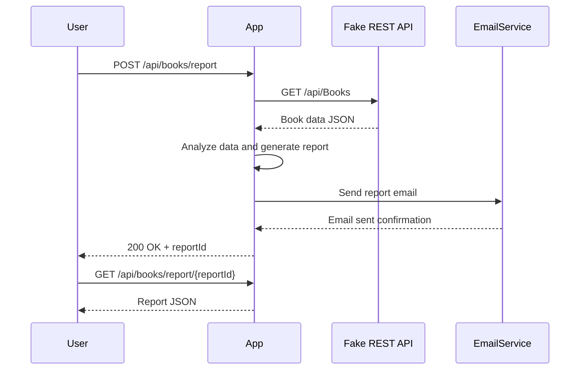
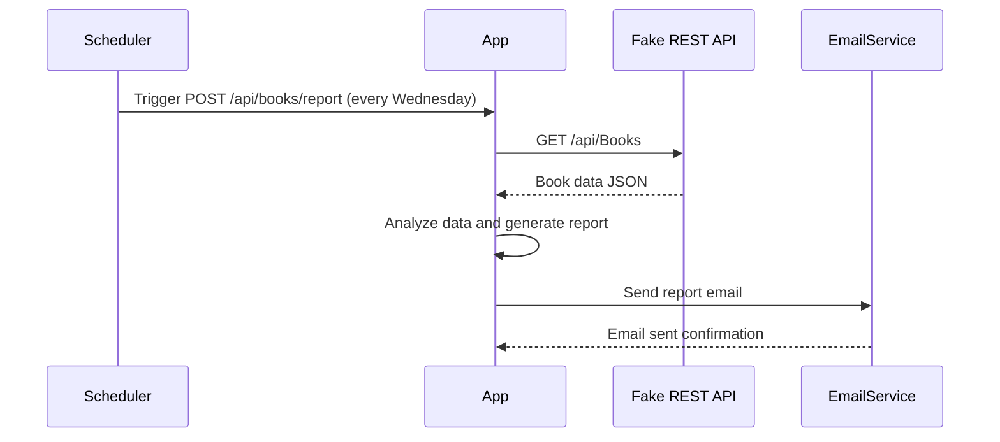

```markdown
# Functional Requirements and API Design

## API Endpoints

### 1. Trigger Data Extraction and Report Generation  
**POST /api/books/report**  
- **Description:** Retrieves book data from the external Fake REST API, processes key metrics, generates the summary report, and sends the report via email.  
- **Request:**  
```json
{}
```  
- **Response:**  
```json
{
  "status": "success",
  "message": "Report generated and emailed successfully",
  "reportId": "string"
}
```

### 2. Retrieve Generated Report  
**GET /api/books/report/{reportId}**  
- **Description:** Retrieves a previously generated report by its ID.  
- **Response:**  
```json
{
  "reportId": "string",
  "generatedAt": "ISO8601 datetime string",
  "totalBooks": "integer",
  "totalPageCount": "integer",
  "publicationDateRange": {
    "earliest": "ISO8601 date string",
    "latest": "ISO8601 date string"
  },
  "popularTitles": [
    {
      "id": "integer",
      "title": "string",
      "descriptionSnippet": "string",
      "excerptSnippet": "string",
      "pageCount": "integer",
      "publishDate": "ISO8601 date string"
    }
  ]
}
```

---

## Business Logic Summary  
- The **POST** endpoint triggers:  
  - Data retrieval from Fake REST API  
  - Calculation of total page counts and publication date range  
  - Identification of popular titles (by highest pageCount)  
  - Generation of summary report  
  - Sending report via email to analytics team  
- The **GET** endpoint provides access to stored reports  

---

## User-App Interaction Sequence Diagram



---

## Weekly Automation Workflow Diagram


```