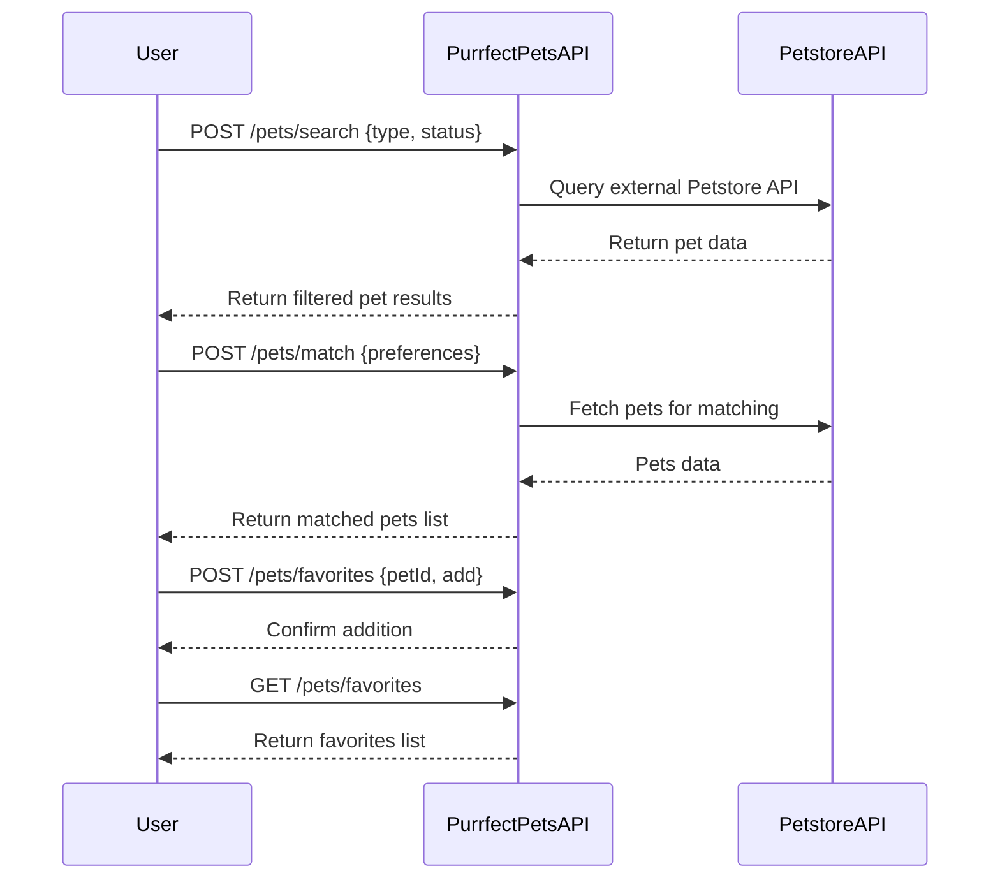

# Purrfect Pets API - Functional Requirements

## Overview
The app exposes a set of RESTful endpoints to manage and interact with pet data, leveraging external Petstore API data for enrichments and business logic.  
- **POST** endpoints handle all external data retrieval, processing, or calculations.  
- **GET** endpoints provide access to stored or computed results within our app.

---

## API Endpoints

### 1. POST /pets/search  
Retrieve and process pet data from the external Petstore API based on search criteria.

**Request** (application/json):  
```json
{
  "type": "cat" | "dog" | "all",
  "status": "available" | "pending" | "sold",
  "name": "optional pet name filter"
}
```

**Response** (application/json):  
```json
{
  "results": [
    {
      "id": 123,
      "name": "Fluffy",
      "type": "cat",
      "status": "available",
      "description": "Friendly cat"
    },
    ...
  ]
}
```

---

### 2. POST /pets/match  
Run a fun matching algorithm to suggest pets based on user preferences.

**Request** (application/json):  
```json
{
  "preferences": {
    "type": "cat" | "dog",
    "ageRange": { "min": 1, "max": 5 },
    "friendly": true
  }
}
```

**Response** (application/json):  
```json
{
  "matches": [
    {
      "id": 456,
      "name": "Buddy",
      "type": "dog",
      "age": 3,
      "friendly": true
    },
    ...
  ]
}
```

---

### 3. GET /pets/{id}  
Retrieve details of a specific pet stored or previously matched.

**Response** (application/json):  
```json
{
  "id": 123,
  "name": "Fluffy",
  "type": "cat",
  "status": "available",
  "description": "Friendly cat",
  "age": 2,
  "friendly": true
}
```

---

### 4. GET /pets/favorites  
Retrieve the list of user's favorite pets (stored in app).

**Response** (application/json):  
```json
{
  "favorites": [
    {
      "id": 123,
      "name": "Fluffy",
      "type": "cat"
    },
    ...
  ]
}
```

---

### 5. POST /pets/favorites  
Add or remove a pet from favorites.

**Request** (application/json):  
```json
{
  "petId": 123,
  "action": "add" | "remove"
}
```

**Response** (application/json):  
```json
{
  "status": "success",
  "message": "Pet added to favorites"
}
```

---

## User-App Interaction Sequence

