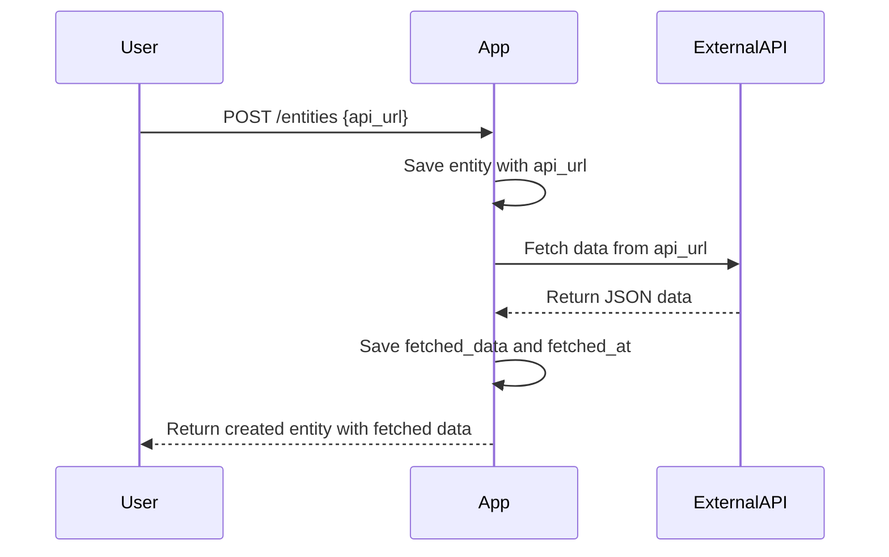
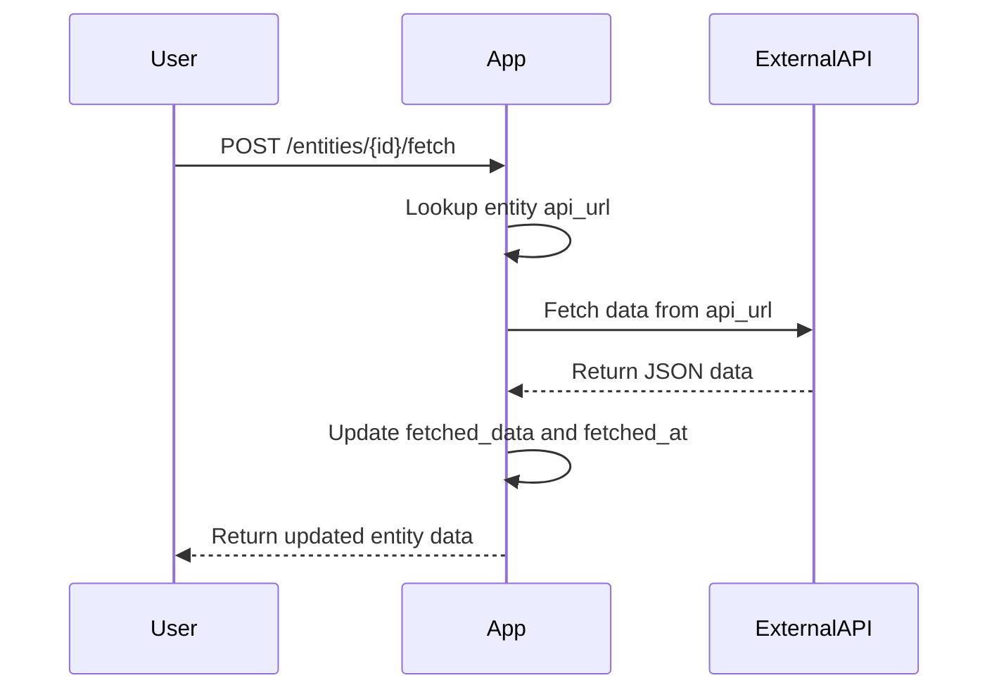
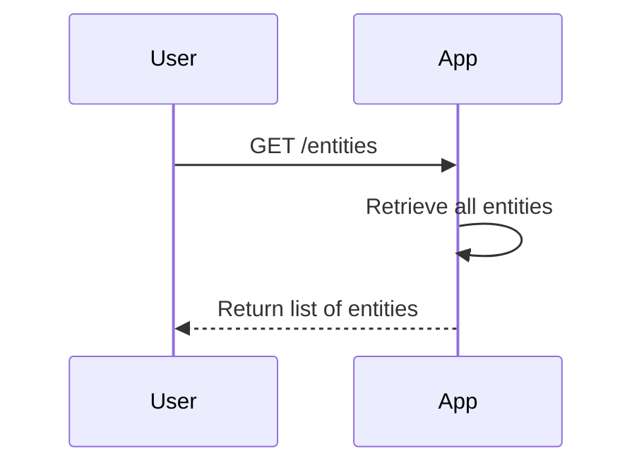

```markdown
# Functional Requirements for Data Fetching App

## Entities

- **Entity** with fields:
  - `id`: unique identifier (UUID or Long)
  - `api_url`: stored as `JsonNode` (user-provided external API URL)
  - `fetched_data`: `JsonNode` (JSON response from external API)
  - `fetched_at`: timestamp (when data was last fetched)

## API Endpoints

### 1. Create Entity  
- **POST** `/entities`  
- **Request Body:**  
  ```json
  {
    "api_url": "<external API URL as JSON string>"
  }
  ```  
- **Response:**  
  ```json
  {
    "id": "<entity_id>",
    "api_url": "<external API URL>",
    "fetched_data": null,
    "fetched_at": null
  }
  ```  
- **Behavior:**  
  - Create entity storing the `api_url`.  
  - Automatically trigger data fetch from `api_url`.  
  - Save fetched data and timestamp in `fetched_data` and `fetched_at`.

---

### 2. Update Entity  
- **POST** `/entities/{id}`  
- **Request Body:**  
  ```json
  {
    "api_url": "<updated external API URL as JSON string>"
  }
  ```  
- **Response:**  
  ```json
  {
    "id": "<entity_id>",
    "api_url": "<updated external API URL>",
    "fetched_data": "<latest fetched JSON data>",
    "fetched_at": "<timestamp>"
  }
  ```  
- **Behavior:**  
  - Update the `api_url`.  
  - Automatically trigger data fetch from updated `api_url`.  
  - Save fetched data and timestamp.

---

### 3. Manual Data Fetch  
- **POST** `/entities/{id}/fetch`  
- **Request Body:** None  
- **Response:**  
  ```json
  {
    "id": "<entity_id>",
    "fetched_data": "<latest fetched JSON data>",
    "fetched_at": "<timestamp>"
  }
  ```  
- **Behavior:**  
  - Trigger fetching data from stored `api_url` for specified entity.  
  - Update `fetched_data` and `fetched_at`.

---

### 4. Get All Entities  
- **GET** `/entities`  
- **Response:**  
  ```json
  [
    {
      "id": "<entity_id>",
      "api_url": "<external API URL>",
      "fetched_data": "<JSON data>",
      "fetched_at": "<timestamp>"
    },
    ...
  ]
  ```  
- **Behavior:**  
  - Return list of all entities with their stored data.

---

### 5. Delete Single Entity  
- **DELETE** `/entities/{id}`  
- **Response:**  
  - HTTP 204 No Content on success.

---

### 6. Delete All Entities  
- **DELETE** `/entities`  
- **Response:**  
  - HTTP 204 No Content on success.

---

# Mermaid Diagrams

## Sequence Diagram: Entity Creation and Auto Fetching



---

## Sequence Diagram: Manual Data Fetch



---

## Sequence Diagram: Get All Entities


```
