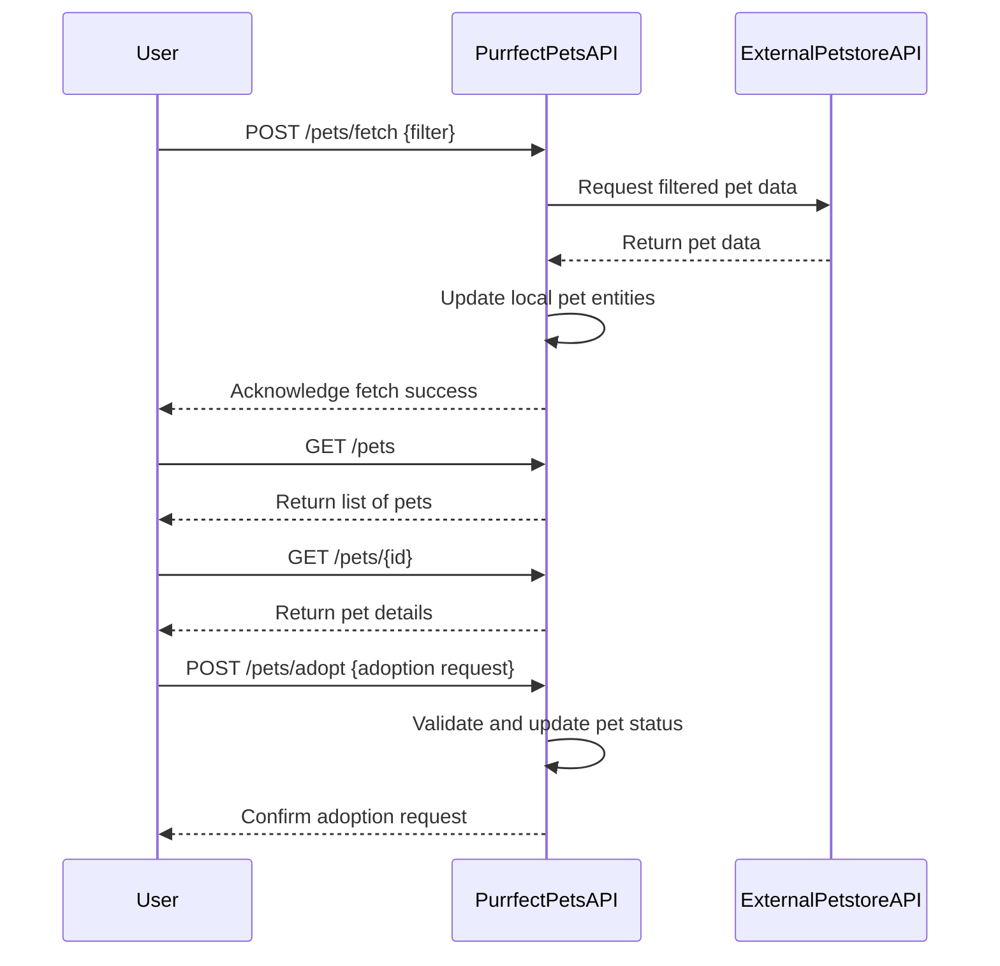

```markdown
# Purrfect Pets API - Functional Requirements

## API Endpoint Overview

### 1. POST /pets/fetch
- **Description:** Fetch pet data from the external Petstore API and store/update in the local app state.
- **Request Body:**  
```json
{
  "filter": {
    "status": "available|pending|sold",
    "tags": ["string"]
  }
}
```
- **Response:**  
```json
{
  "message": "Fetched and updated pets successfully",
  "count": 10
}
```
- **Business Logic:**  
Invokes external Petstore API, applies filters, updates local entities with fresh pet data.

---

### 2. GET /pets
- **Description:** Retrieve the list of pets stored in the local app.
- **Response:**  
```json
[
  {
    "id": 1,
    "name": "Fluffy",
    "status": "available",
    "tags": ["cute", "small"],
    "category": "cat"
  }
]
```

---

### 3. GET /pets/{id}
- **Description:** Retrieve details of a single pet by its ID.
- **Response:**  
```json
{
  "id": 1,
  "name": "Fluffy",
  "status": "available",
  "tags": ["cute", "small"],
  "category": "cat",
  "photoUrls": ["http://example.com/photo1.jpg"]
}
```

---

### 4. POST /pets/adopt
- **Description:** Submit an adoption request for a pet (business logic includes validation and status update).
- **Request Body:**  
```json
{
  "petId": 1,
  "adopterName": "John Doe",
  "contactInfo": "john@example.com"
}
```
- **Response:**  
```json
{
  "message": "Adoption request received",
  "petId": 1,
  "status": "pending"
}
```

---

## User-App Interaction Sequence Diagram


```