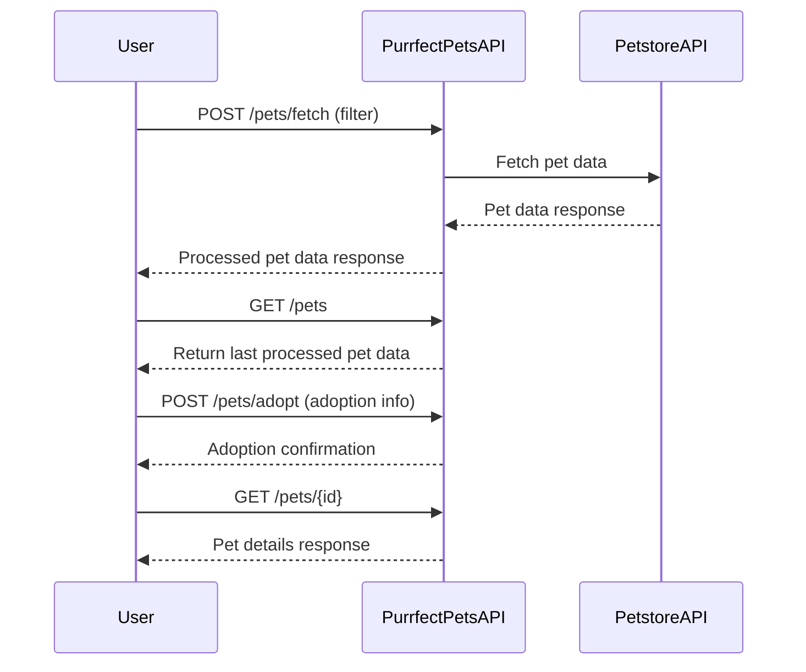
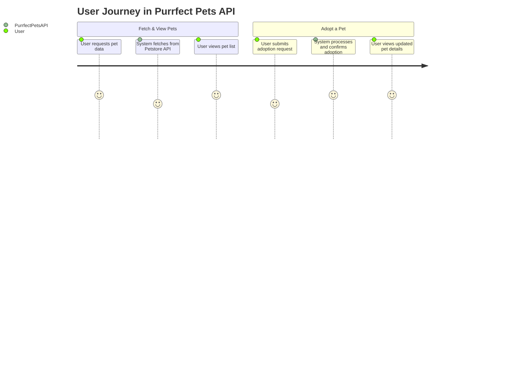

# Purrfect Pets API Functional Requirements

## API Endpoints

### 1. POST /pets/fetch  
Fetch pet data from the external Petstore API and process it (e.g., filtering, enrichment, or calculations).  
**Request:**  
```json
{
  "filter": {
    "type": "cat" | "dog" | "all",
    "status": "available" | "pending" | "sold" | null
  }
}
```
**Response:**  
```json
{
  "processedPets": [
    {
      "id": "string",
      "name": "string",
      "type": "cat" | "dog",
      "status": "available" | "pending" | "sold",
      "age": "number",
      "funFact": "string"
    }
  ]
}
```

### 2. GET /pets  
Retrieve the last fetched and processed pet data stored in the application.  
**Response:**  
```json
{
  "pets": [
    {
      "id": "string",
      "name": "string",
      "type": "cat" | "dog",
      "status": "available" | "pending" | "sold",
      "age": "number",
      "funFact": "string"
    }
  ]
}
```

### 3. POST /pets/adopt  
Register an adoption event for a pet and update its status.  
**Request:**  
```json
{
  "petId": "string",
  "adopterName": "string",
  "adoptionDate": "YYYY-MM-DD"
}
```
**Response:**  
```json
{
  "success": true,
  "message": "Pet adoption recorded successfully"
}
```

### 4. GET /pets/{id}  
Retrieve details of a specific pet by ID.  
**Response:**  
```json
{
  "id": "string",
  "name": "string",
  "type": "cat" | "dog",
  "status": "available" | "pending" | "sold",
  "age": "number",
  "funFact": "string"
}
```

---

## Mermaid Sequence Diagram: User Interaction with Purrfect Pets API



---

## Mermaid Journey Diagram: User Journey in Purrfect Pets App

