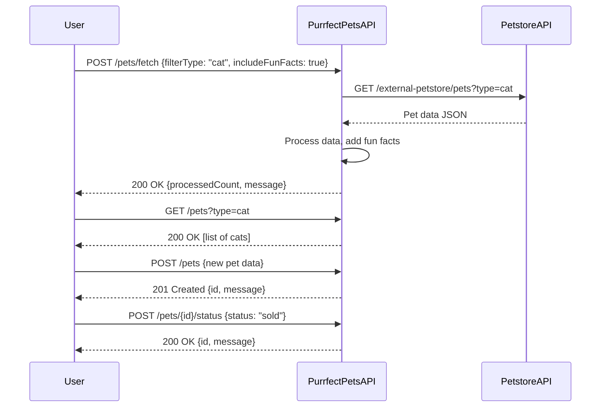

# Purrfect Pets API - Functional Requirements

## API Endpoints

### 1. Retrieve Pets (GET)  
**Endpoint:** `/pets`  
**Description:** Retrieve a list of pets previously processed or stored in the app. Supports optional filtering by pet type or status.  
**Query Parameters:**  
- `type` (optional): string, e.g., "cat", "dog"  
- `status` (optional): string, e.g., "available", "sold"  

**Response (application/json):**  
```json
[
  {
    "id": "123",
    "name": "Whiskers",
    "type": "cat",
    "status": "available",
    "description": "A playful cat"
  }
]
```

---

### 2. Fetch & Process Pets From External Petstore API (POST)  
**Endpoint:** `/pets/fetch`  
**Description:** Trigger retrieval of pet data from the external Petstore API, process the data (e.g., filter by type, enrich with fun facts), and store it in the app for later retrieval.  
**Request (application/json):**  
```json
{
  "filterType": "cat",          
  "includeFunFacts": true       
}
```

**Response (application/json):**  
```json
{
  "processedCount": 42,
  "message": "Pets fetched and processed successfully"
}
```

---

### 3. Add New Pet (POST)  
**Endpoint:** `/pets`  
**Description:** Add a new pet entry to the app database.  
**Request (application/json):**  
```json
{
  "name": "Mittens",
  "type": "cat",
  "status": "available",
  "description": "Loves to nap in sunny spots"
}
```

**Response (application/json):**  
```json
{
  "id": "generated-id",
  "message": "Pet added successfully"
}
```

---

### 4. Update Pet Status (POST)  
**Endpoint:** `/pets/{id}/status`  
**Description:** Update the status of an existing pet (e.g., available, sold).  
**Request (application/json):**  
```json
{
  "status": "sold"
}
```

**Response (application/json):**  
```json
{
  "id": "123",
  "message": "Pet status updated successfully"
}
```

---

## User-App Interaction Sequence Diagram



---

### Notes  
- GET endpoints only return stored data and do not call external APIs directly.  
- POST endpoints are used for external data retrieval and any business logic processing.  
- JSON is used for all request and response payloads.