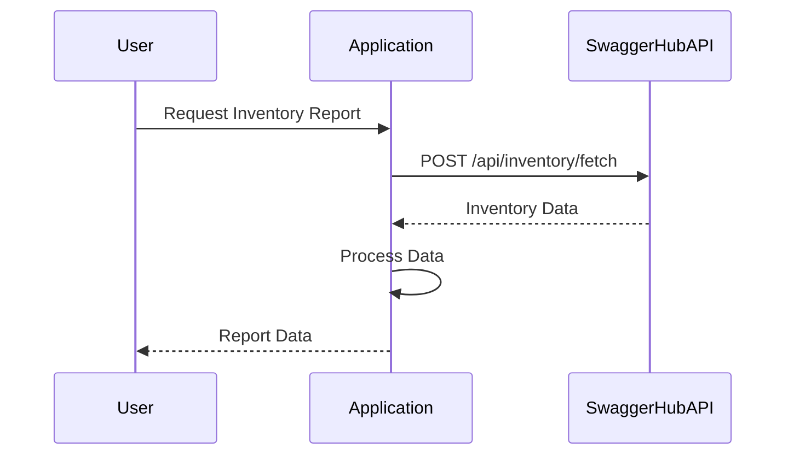

# Final Functional Requirements for Inventory Reporting Application

## API Endpoints

### 1. Retrieve Inventory Data
- **Endpoint**: `/api/inventory/fetch`
- **Method**: POST
- **Description**: This endpoint retrieves inventory data from the SwaggerHub API, processes it to calculate metrics, and stores the results internally.
- **Request Format**:
  ```json
  {
    "filter": {
      "category": "electronics",
      "priceRange": {
        "min": 100,
        "max": 1000
      }
    }
  }
  ```
- **Response Format**:
  ```json
  {
    "status": "success",
    "message": "Data fetched and processed successfully."
  }
  ```

### 2. Get Report
- **Endpoint**: `/api/inventory/report`
- **Method**: GET
- **Description**: This endpoint retrieves the processed report data for the user.
- **Response Format**:
  ```json
  {
    "totalItems": 150,
    "averagePrice": 250.75,
    "totalValue": 37500,
    "statistics": {
      "categoryDistribution": {
        "electronics": 50,
        "furniture": 100
      }
    }
  }
  ```

## User-App Interaction Diagram



This document outlines the confirmed functional requirements for the inventory reporting application, including the necessary RESTful API endpoints and a visual representation of the user interaction with the application.