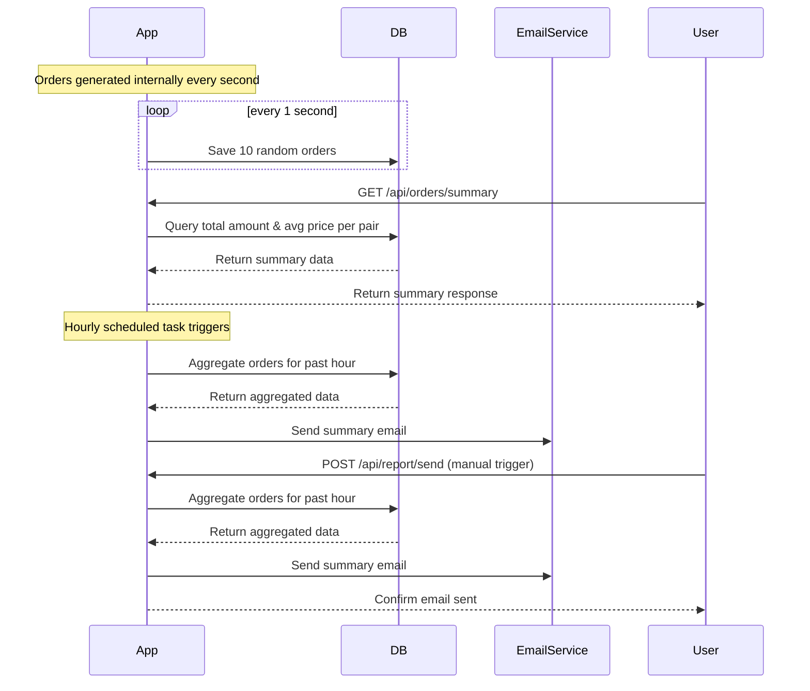

```markdown
# Final Functional Requirements & API Design

## Overview
The application continuously generates random orders internally at a rate of 10 orders per second, using a fixed set of trading pairs (e.g., BTC/USD, ETH/USD). Orders contain the following fields: side (buy/sell), price, amount, pair, and timestamp. These orders are stored in the database.

Every hour, the app sends an email report summarizing the total amount of orders and the average price for each pair. The app exposes API endpoints for retrieving order summaries and triggering the email report manually.

---

## API Endpoints

### 1. Retrieve Orders Summary (GET)
- **URL:** `/api/orders/summary`
- **Description:** Retrieve the total amount and average price per pair for all stored orders.
- **Response:**
  ```json
  {
    "summary": [
      {
        "pair": "BTC/USD",
        "totalAmount": 1234.56,
        "averagePrice": 45000.78
      },
      {
        "pair": "ETH/USD",
        "totalAmount": 789.01,
        "averagePrice": 3200.45
      }
    ]
  }
  ```

### 2. Trigger Hourly Email Report (POST)
- **URL:** `/api/report/send`
- **Description:** Manually trigger sending the hourly summary email with total amount and average price per pair.
- **Request Body:** *(optional, can be empty)*
- **Response:**
  ```json
  {
    "status": "email_sent",
    "message": "Hourly report email has been sent"
  }
  ```

---

## Business Logic Notes
- The application internally generates 10 random orders per second continuously.
- Orders are distributed randomly among the fixed set of pairs (e.g., BTC/USD, ETH/USD).
- The hourly email report summarizes total amounts and average prices per pair.
- Order generation runs autonomously without API control endpoints.
- GET endpoints only retrieve already stored/calculated data.
- POST endpoints handle triggers for business logic like sending emails.

---

## User-App Interaction Sequence Diagram


```

If you have no further questions or adjustments, I can proceed to finish the discussion.