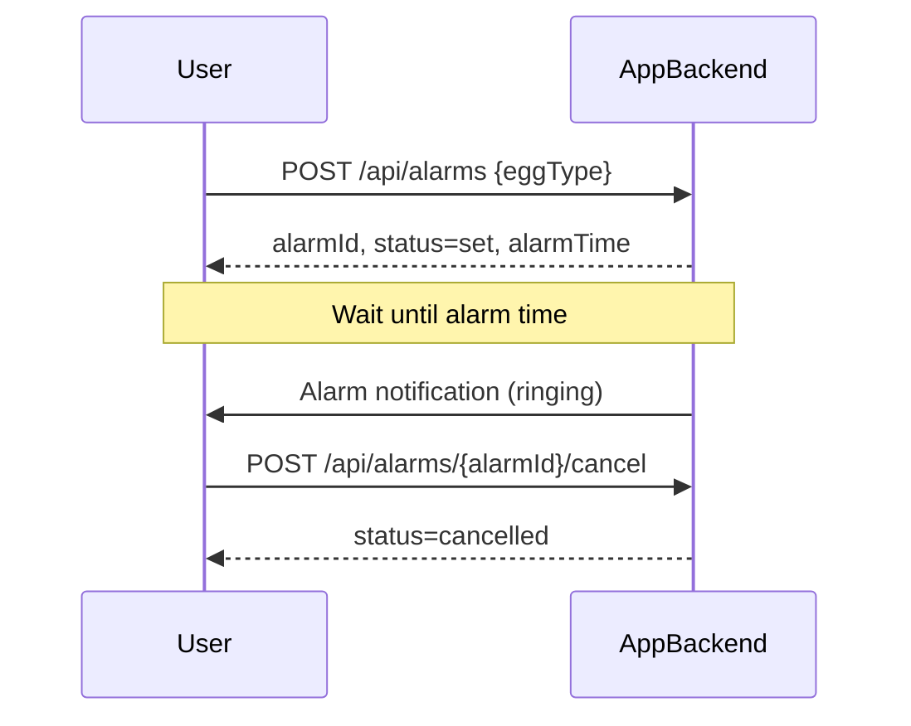
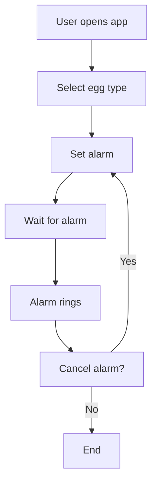

```markdown
# Egg Alarm App - Functional Requirements and API Design

## Functional Requirements Summary
- User selects egg type: soft-boiled, medium-boiled, or hard-boiled.
- User sets an alarm based on selected egg type.
- Alarm triggers a sound notification.
- User can cancel or reset the alarm.
- Multiple alarms for different egg types are not supported (one alarm at a time).

---

## API Endpoints

### 1. Set Alarm
- **Endpoint:** `POST /api/alarms`
- **Description:** Set an alarm for the selected egg type. Calculates alarm time based on egg type and starts the alarm workflow.
- **Request Body:**
  ```json
  {
    "eggType": "soft" | "medium" | "hard"
  }
  ```
- **Response:**
  ```json
  {
    "alarmId": "string",
    "eggType": "soft" | "medium" | "hard",
    "status": "set",
    "setTime": "ISO8601 timestamp",
    "alarmTime": "ISO8601 timestamp"
  }
  ```

### 2. Get Alarm Status
- **Endpoint:** `GET /api/alarms/{alarmId}`
- **Description:** Retrieve the current status of an alarm.
- **Response:**
  ```json
  {
    "alarmId": "string",
    "eggType": "soft" | "medium" | "hard",
    "status": "set" | "ringing" | "cancelled" | "completed",
    "setTime": "ISO8601 timestamp",
    "alarmTime": "ISO8601 timestamp"
  }
  ```

### 3. Cancel Alarm
- **Endpoint:** `POST /api/alarms/{alarmId}/cancel`
- **Description:** Cancel an active alarm.
- **Request Body:** *(empty)*
- **Response:**
  ```json
  {
    "alarmId": "string",
    "status": "cancelled"
  }
  ```

---

## User-App Interaction Sequence Diagram



---

## User Journey Diagram


```