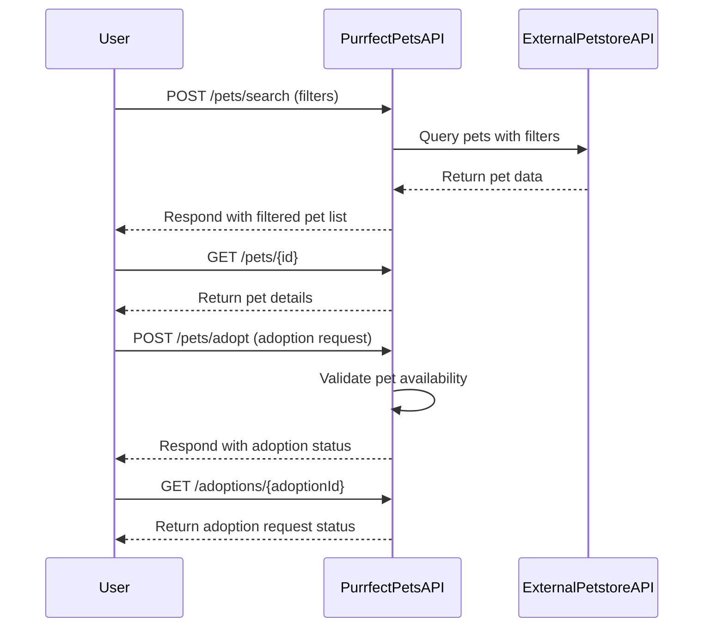

# Purrfect Pets API Functional Requirements

## API Endpoints

### 1. POST /pets/search  
**Description:** Search pets using filters or criteria. Retrieves data from the external Petstore API, applies any business logic, and returns results.  
**Request:**  
```json
{
  "type": "string",           // optional, e.g., "cat", "dog"
  "status": "string",         // optional, e.g., "available", "sold"
  "name": "string"            // optional, partial or full pet name
}
```  
**Response:**  
```json
{
  "pets": [
    {
      "id": "integer",
      "name": "string",
      "type": "string",
      "status": "string",
      "photoUrls": ["string"]
    }
  ]
}
```

---

### 2. GET /pets/{id}  
**Description:** Retrieve detailed information about a specific pet by ID. Returns data cached or saved internally after a previous POST search or fetch.  
**Response:**  
```json
{
  "id": "integer",
  "name": "string",
  "type": "string",
  "status": "string",
  "photoUrls": ["string"],
  "tags": ["string"]
}
```

---

### 3. POST /pets/adopt  
**Description:** Submit an adoption request for a pet. Business logic may validate pet availability before confirming adoption.  
**Request:**  
```json
{
  "petId": "integer",
  "adopterName": "string",
  "adopterContact": "string"
}
```  
**Response:**  
```json
{
  "adoptionId": "string",
  "status": "string",    // e.g., "pending", "approved"
  "message": "string"
}
```

---

### 4. GET /adoptions/{adoptionId}  
**Description:** Check the status of a submitted adoption request.  
**Response:**  
```json
{
  "adoptionId": "string",
  "petId": "integer",
  "adopterName": "string",
  "status": "string",
  "message": "string"
}
```

---

# User-App Interaction Sequence Diagram

