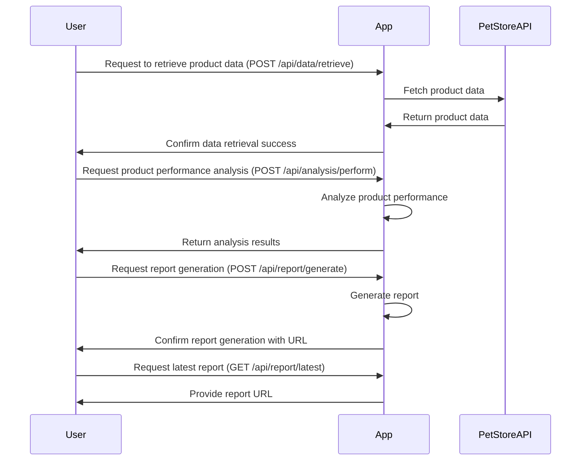

# Product Performance Analysis and Reporting System Functional Requirements

## API Endpoints

### 1. Fetch Data from Pet Store API
- **Endpoint**: `/api/data/retrieve`
- **Method**: POST
- **Request Format**:
  ```json
  {
    "date": "YYYY-MM-DD"
  }
  ```
- **Response Format**:
  ```json
  {
    "status": "success",
    "message": "Data retrieved successfully",
    "data": {
      "products": [
        {
          "id": "string",
          "name": "string",
          "salesData": {
            "salesVolume": "number",
            "revenue": "number"
          },
          "stockLevel": "number"
        }
      ]
    }
  }
  ```

### 2. Analyze Product Performance
- **Endpoint**: `/api/analysis/perform`
- **Method**: POST
- **Request Format**:
  ```json
  {
    "data": [
      {
        "id": "string",
        "salesVolume": "number",
        "revenue": "number",
        "stockLevel": "number"
      }
    ]
  }
  ```
- **Response Format**:
  ```json
  {
    "status": "success",
    "message": "Analysis complete",
    "analysis": {
      "highPerformingProducts": ["string"],
      "lowStockProducts": ["string"],
      "trends": "string"
    }
  }
  ```

### 3. Generate Report
- **Endpoint**: `/api/report/generate`
- **Method**: POST
- **Request Format**:
  ```json
  {
    "analysis": {
      "highPerformingProducts": ["string"],
      "lowStockProducts": ["string"],
      "trends": "string"
    }
  }
  ```
- **Response Format**:
  ```json
  {
    "status": "success",
    "message": "Report generated successfully",
    "reportUrl": "string"
  }
  ```

### 4. Get Latest Report
- **Endpoint**: `/api/report/latest`
- **Method**: GET
- **Response Format**:
  ```json
  {
    "status": "success",
    "reportUrl": "string"
  }
  ```

## User-App Interaction Diagram



This document outlines the necessary API endpoints and provides a visual representation of user interaction with the application, focusing on the key functional requirements for the Product Performance Analysis and Reporting System.