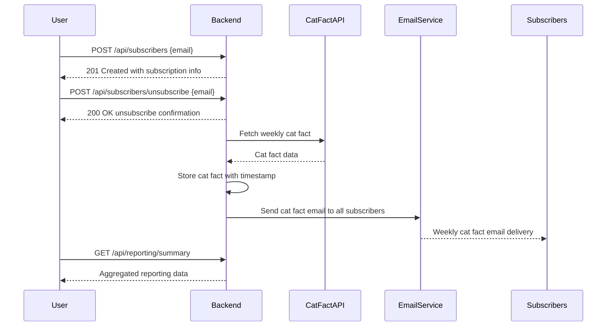
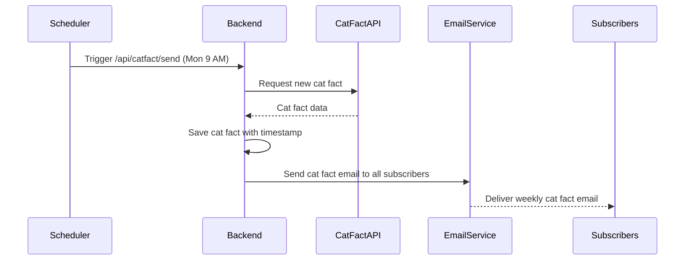

```markdown
# Functional Requirements for Weekly Cat Fact Subscription Application

## Overview
The application sends subscribers a new cat fact every week via email. It fetches one new cat fact weekly from an external API, stores it with a timestamp, and sends the same fact to all subscribers. Subscribers can sign up and unsubscribe via email only. The system tracks email opens via tracking pixels and maintains aggregated reporting data accessible via an API.

---

## Functional Requirements

### 1. Subscriber Management
- Users subscribe by providing their email only.
- No confirmation email is sent upon subscription.
- Users can unsubscribe by clicking a link in the email, which immediately removes them without confirmation.

### 2. Cat Fact Retrieval and Delivery
- The system fetches exactly one new cat fact from the external Cat Fact API once per week (every Monday at 9 AM).
- If the API call fails, the system skips sending the fact that week and logs the error.
- Each fetched cat fact is stored with a timestamp for record-keeping.
- The same cat fact is sent to all subscribers.
- Emails are sent in HTML format with a clear subject line and include an unsubscribe link.

### 3. Reporting and Tracking
- Email opens are tracked using tracking pixels.
- The reporting API provides aggregated current data only, including:
  - Total number of subscribers
  - Total number of email opens
  - Total number of unsubscribes
- Historical trends or detailed subscriber-level reporting are not required.

---

## API Endpoints Summary

| Endpoint                       | Method | Description                                  | Request Body         | Response                              |
|-------------------------------|--------|----------------------------------------------|----------------------|-------------------------------------|
| `/api/subscribers`             | POST   | Add a new subscriber                          | `{ "email": "..." }` | Subscriber info with ID and timestamp |
| `/api/subscribers/unsubscribe`| POST   | Unsubscribe a user immediately                | `{ "email": "..." }` | Confirmation message                |
| `/api/catfact/send`            | POST   | Fetch and send weekly cat fact to subscribers| `{}`                 | Sent fact info and stats            |
| `/api/reporting/summary`       | GET    | Get aggregated reporting data                 | None                 | Aggregated stats (subscribers, opens, unsubscribes) |

---

## Example Interaction Flows




```