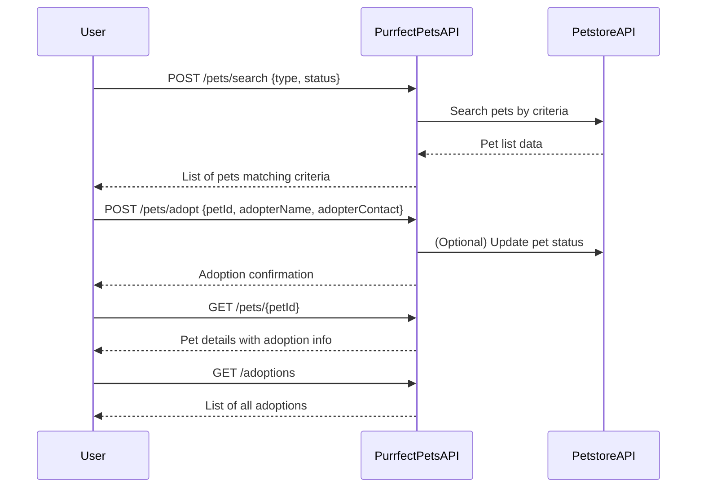

# Purrfect Pets API - Functional Requirements

## API Endpoints

### 1. `POST /pets/search`
- **Description:** Search pets by criteria (e.g., type, status) by invoking Petstore API.
- **Request:**
```json
{
  "type": "string (optional, e.g., dog, cat)",
  "status": "string (optional, e.g., available, sold)"
}
```
- **Response:**
```json
{
  "pets": [
    {
      "id": "integer",
      "name": "string",
      "type": "string",
      "status": "string",
      "details": "string (optional extra info)"
    }
  ]
}
```

---

### 2. `POST /pets/adopt`
- **Description:** Register adoption of a pet (calls external API or updates internal state).
- **Request:**
```json
{
  "petId": "integer",
  "adopterName": "string",
  "adopterContact": "string"
}
```
- **Response:**
```json
{
  "success": true,
  "message": "Adoption registered successfully",
  "adoptionId": "string"
}
```

---

### 3. `GET /pets/{petId}`
- **Description:** Retrieve pet details stored in the app (including adoption status).
- **Response:**
```json
{
  "id": "integer",
  "name": "string",
  "type": "string",
  "status": "string",
  "adoptionInfo": {
    "adopterName": "string",
    "adopterContact": "string",
    "adoptionDate": "string (ISO 8601)"
  }
}
```

---

### 4. `GET /adoptions`
- **Description:** List all adoptions recorded in the app.
- **Response:**
```json
{
  "adoptions": [
    {
      "adoptionId": "string",
      "petId": "integer",
      "petName": "string",
      "adopterName": "string",
      "adoptionDate": "string (ISO 8601)"
    }
  ]
}
```

---

## User-App Interaction Sequence Diagram

