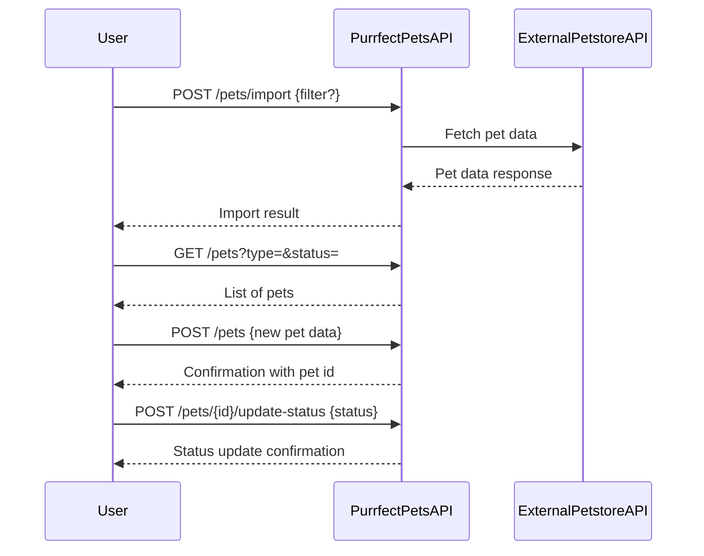
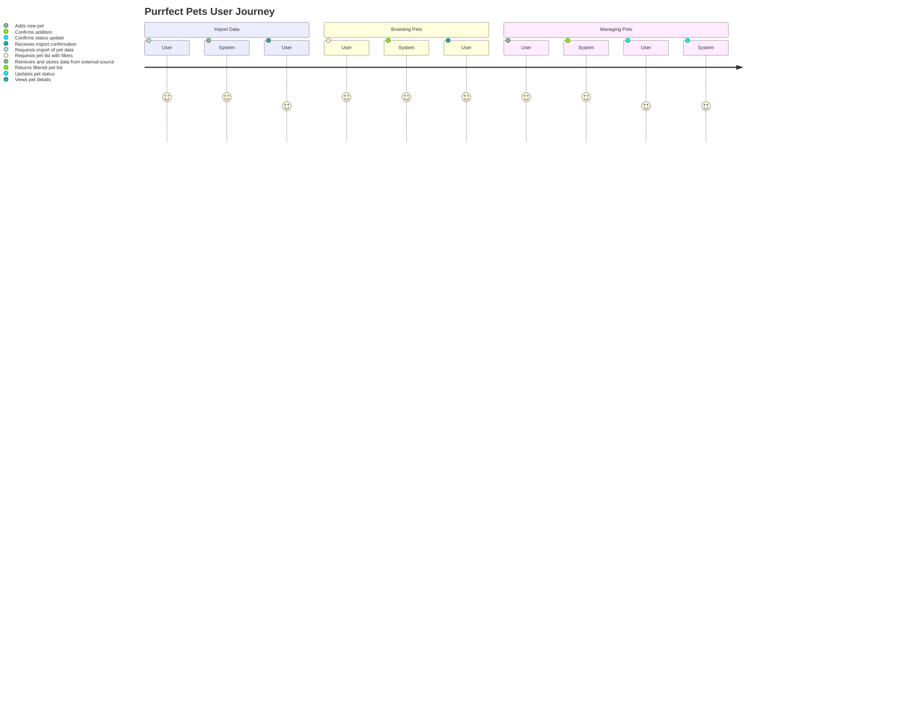

```markdown
# Purrfect Pets API - Functional Requirements

## API Endpoints

### 1. POST /pets/import  
**Description:** Import or refresh pet data from the external Petstore API.  
**Request Body:**  
```json
{
  "source": "petstore",
  "filter": {
    "type": "string (optional)",
    "status": "string (optional)"
  }
}
```  
**Response:**  
```json
{
  "importedCount": "integer",
  "message": "string"
}
```

### 2. GET /pets  
**Description:** Retrieve a list of pets stored in the application. Supports filtering by type and status via query parameters.  
**Query Parameters (optional):**  
- type (string)  
- status (string)  
**Response:**  
```json
[
  {
    "id": "string",
    "name": "string",
    "type": "string",
    "age": "integer",
    "status": "string"
  }
]
```

### 3. GET /pets/{id}  
**Description:** Retrieve details for a specific pet by ID.  
**Response:**  
```json
{
  "id": "string",
  "name": "string",
  "type": "string",
  "age": "integer",
  "status": "string",
  "description": "string"
}
```

### 4. POST /pets  
**Description:** Add a new pet to the application.  
**Request Body:**  
```json
{
  "name": "string",
  "type": "string",
  "age": "integer",
  "status": "string",
  "description": "string (optional)"
}
```  
**Response:**  
```json
{
  "id": "string",
  "message": "Pet added successfully"
}
```

### 5. POST /pets/{id}/update-status  
**Description:** Update pet adoption status or other mutable fields.  
**Request Body:**  
```json
{
  "status": "string"
}
```  
**Response:**  
```json
{
  "id": "string",
  "newStatus": "string",
  "message": "Status updated successfully"
}
```

---

## User-App Interaction Sequence




```