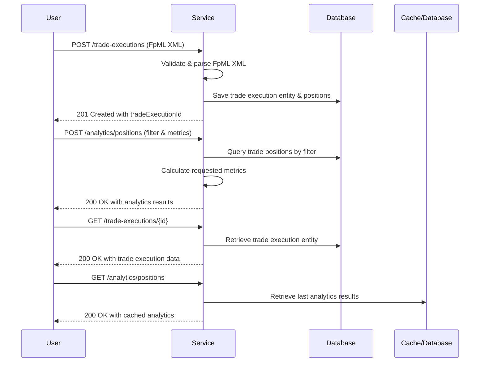

```markdown
# Functional Requirements for FpML Trade Execution Service

## API Endpoints

### 1. POST /trade-executions
- **Purpose:** Accept FpML trade execution XML message, validate it, parse trade positions, and save as entities.
- **Request:**
  - Content-Type: application/xml
  - Body: FpML trade execution XML message
- **Response:**
  - Status: 201 Created
  - Body:
    ```json
    {
      "tradeExecutionId": "<generated_id>",
      "message": "Trade execution saved successfully."
    }
    ```

### 2. POST /analytics/positions
- **Purpose:** Run analytics on trade positions based on provided filters and requested metrics.
- **Request:**
  - Content-Type: application/json
  - Body example:
    ```json
    {
      "filter": {
        "counterparty": "CounterpartyA",
        "instrumentType": "InterestRateSwap"
      },
      "metrics": ["aggregateNotional", "positionCount"]
    }
    ```
- **Response:**
  - Status: 200 OK
  - Body example:
    ```json
    {
      "aggregateNotional": 150000000,
      "positionCount": 12
    }
    ```

### 3. GET /trade-executions/{id}
- **Purpose:** Retrieve stored trade execution entity by its ID.
- **Response:**
  - Status: 200 OK
  - Body example:
    ```json
    {
      "tradeExecutionId": "12345",
      "rawFpmlXml": "<FpML>...</FpML>",
      "parsedPositions": [
        {
          "positionId": "pos1",
          "instrument": "InterestRateSwap",
          "notional": 10000000,
          "counterparty": "CounterpartyA"
        }
      ]
    }
    ```

### 4. GET /analytics/positions
- **Purpose:** Retrieve last run analytics results or cached analytics data.
- **Response:**
  - Status: 200 OK
  - Body example:
    ```json
    {
      "lastRun": "2024-06-01T12:00:00Z",
      "results": {
        "aggregateNotional": 150000000,
        "positionCount": 12
      }
    }
    ```

---

## User-App Interaction Sequence Diagram



---

## Summary

- POST endpoints handle XML ingestion and analytics calculations (including any business logic invoking external data).
- GET endpoints serve stored trade executions and cached analytics results.
- Trade executions and parsed trade positions are stored as entities.
- Analytics support flexible filters and requested metric calculations.
```
