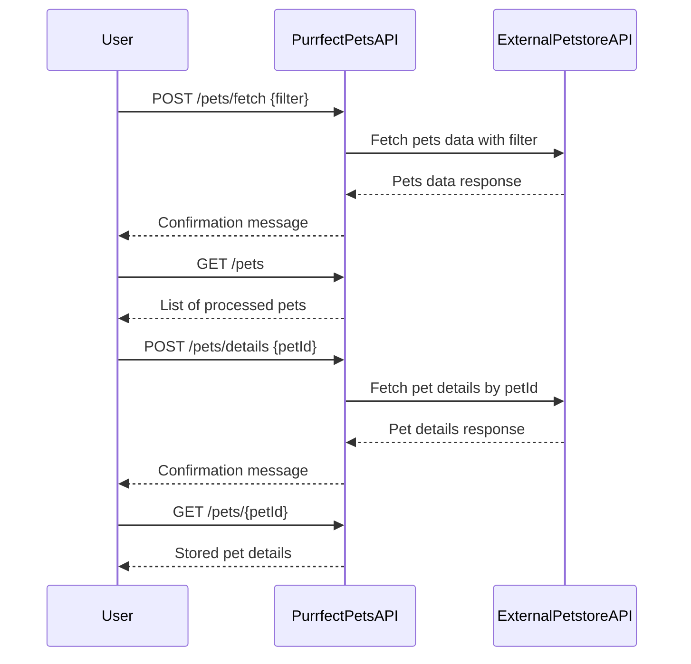

```markdown
# Purrfect Pets API - Functional Requirements

## Overview
The API provides pet-related data based on the Petstore API.  
- All external data retrieval and business logic are triggered via POST endpoints.  
- GET endpoints only retrieve stored or processed data within our application.

---

## API Endpoints

### 1. Fetch & Process Pets Data  
**POST** `/pets/fetch`  
- **Description:** Retrieve pets data from external Petstore API, apply any business logic, and store results internally for later retrieval.  
- **Request Body:**  
```json
{
  "filter": {
    "type": "string (optional)",
    "status": "string (optional)"
  }
}
```  
- **Response:**  
```json
{
  "message": "Pets data fetched and processed successfully",
  "count": "number of pets processed"
}
```

---

### 2. Get Stored Pets List  
**GET** `/pets`  
- **Description:** Retrieve list of pets previously fetched and processed.  
- **Response:**  
```json
[
  {
    "id": "integer",
    "name": "string",
    "type": "string",
    "status": "string",
    "photoUrls": ["string"]
  }
]
```

---

### 3. Fetch & Store Pet Details  
**POST** `/pets/details`  
- **Description:** Fetch detailed info for a specific pet by ID from external API, process and store locally.  
- **Request Body:**  
```json
{
  "petId": "integer"
}
```  
- **Response:**  
```json
{
  "message": "Pet details fetched and stored successfully",
  "petId": "integer"
}
```

---

### 4. Get Pet Details  
**GET** `/pets/{petId}`  
- **Description:** Retrieve stored detailed information for a pet by ID.  
- **Response:**  
```json
{
  "id": "integer",
  "name": "string",
  "type": "string",
  "status": "string",
  "category": {
    "id": "integer",
    "name": "string"
  },
  "photoUrls": ["string"],
  "tags": [
    {
      "id": "integer",
      "name": "string"
    }
  ]
}
```

---

## User-App Interaction Sequence



---

## Notes
- POST endpoints are responsible for all external API calls and business logic.  
- GET endpoints serve only stored or processed data for quick retrieval.  
- Data fetched from external API is cached or persisted internally.  
- Filtering and validation are applied in POST endpoints.
```
