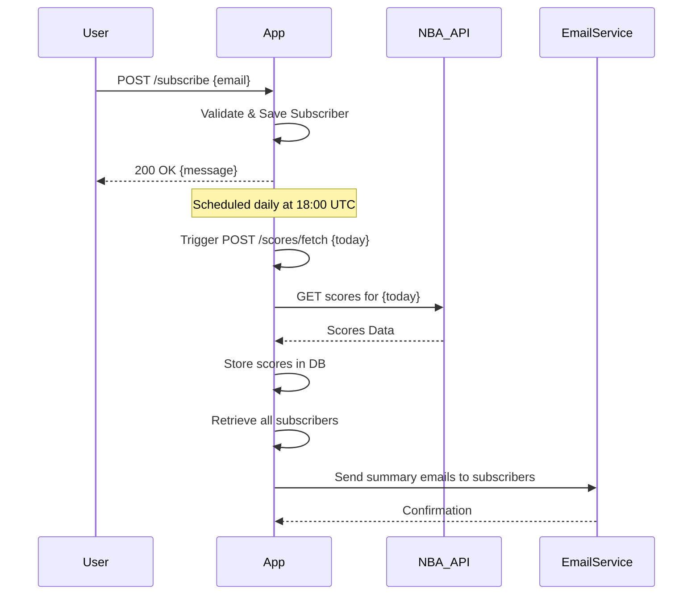

# Functional Requirements for NBA Scores Notification System

## API Endpoints

### 1. Subscribe to Notifications  
**POST /subscribe**  
- **Description:** Adds a user to the subscription list for daily NBA score notifications.  
- **Request Body (JSON):**  
  ```json
  {
    "email": "user@example.com"
  }
  ```  
- **Response (JSON):**  
  ```json
  {
    "message": "Subscription successful",
    "email": "user@example.com"
  }
  ```  
- **Business Logic:**  
  - Validate email format  
  - Enforce unique email subscriptions  
  - Save subscriber email to database  

---

### 2. Fetch and Store NBA Scores (Scheduled or Manual Trigger)  
**POST /scores/fetch**  
- **Description:** Fetches NBA scores from external API for specified date, stores them locally, and triggers email notifications to subscribers.  
- **Request Body (JSON):**  
  ```json
  {
    "date": "YYYY-MM-DD"
  }
  ```  
- **Response (JSON):**  
  ```json
  {
    "message": "Scores fetched and notifications sent for date YYYY-MM-DD"
  }
  ```  
- **Business Logic:**  
  - Compose external API request URL with given date  
  - Asynchronously fetch data from external API  
  - Parse and store game data in database  
  - Retrieve subscriber list and send email notifications with daily summary  

---

### 3. Retrieve All Subscribers  
**GET /subscribers**  
- **Description:** Retrieves the list of all subscribed email addresses.  
- **Response (JSON):**  
  ```json
  {
    "subscribers": [
      "user1@example.com",
      "user2@example.com"
    ]
  }
  ```  

---

### 4. Retrieve All Games (with Pagination)  
**GET /games/all?page={page}&size={size}**  
- **Description:** Retrieves all stored NBA games with optional pagination.  
- **Response (JSON):**  
  ```json
  {
    "page": 1,
    "size": 10,
    "totalPages": 5,
    "totalGames": 50,
    "games": [
      {
        "date": "YYYY-MM-DD",
        "homeTeam": "Team A",
        "awayTeam": "Team B",
        "homeScore": 100,
        "awayScore": 95,
        "status": "Final"
      }
    ]
  }
  ```  

---

### 5. Retrieve Games by Date  
**GET /games/{date}**  
- **Description:** Retrieves all NBA games for a specific date.  
- **Response (JSON):**  
  ```json
  {
    "date": "YYYY-MM-DD",
    "games": [
      {
        "homeTeam": "Team A",
        "awayTeam": "Team B",
        "homeScore": 100,
        "awayScore": 95,
        "status": "Final"
      }
    ]
  }
  ```  

---

## User-App Interaction Sequence



## Data Flow for Fetch and Notify

```mermaid
flowchart TD
    A[Scheduler triggers fetch] --> B[POST /scores/fetch {date}]
    B --> C[Fetch NBA scores from external API]
    C --> D[Store scores in local DB]
    D --> E[Retrieve subscribers from DB]
    E --> F[Send email notifications with scores]
```